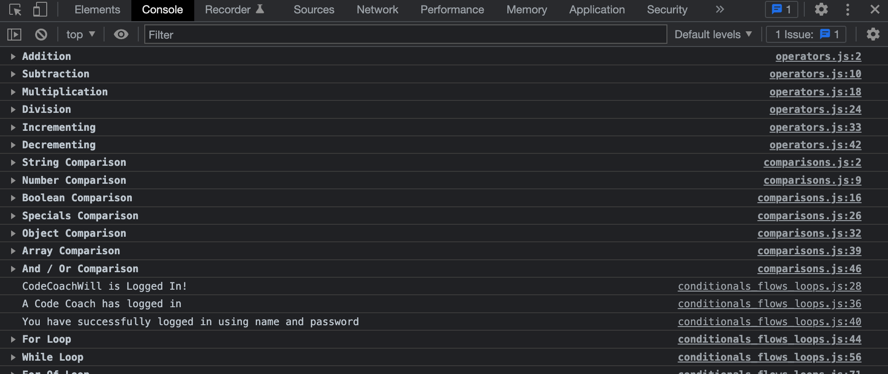

# JavaScript Foundations - Part 1

## Preparation

### GOALS

By the end of this lesson, you will be able to:

1. **Declare variables and understand common data types**
2. **Use JS Operators**
3. **Create comparisons between variables**
4. **Create conditional flows and loops**

---



---

### CONCEPTS

- **Data Types:** _Data types_ are a classification that specifies which _type_ of value a variable has and what type of mathematical, relational, or logical operations can be applied to it (without causing an error).

- **Operators:** _Operators_ are objects capable of manipulating or evaluating an expression. Standard operators include, but are not limited to:

  - \+
  - \-
  - \
  - \*
  - \>
  - <
  - ===
  - !==

- **Conditional Statement:** _Conditional Statements_ are a programming expression or command that instructs a computer to run code if a specified statement is truthy or not.

---

---

## Walkthrough

### STEP 1: TYPES & VARIABLES

**Aim**: Comprehend the various JavaScript variables and variable types.

| _./types_and_variables.js_ |

- [ ] **Walkthrough JavaScript Strings**
  - Double quotes are valid
  - Single quotes are valid
  - Numbers in quotes are of type strings

```jsx
// * string * \\
"Anything wrapped in quotes is a string";
"They can be double quotes or single quotes";
"2";
```

🔻

- [ ] **Walkthrough JavaScript Numbers**
  - All numbers are floating point (decimals)

```jsx
// * number * \\
1; // 1.0
10.0;
13.9;
```

🔻

- [ ] **Walkthrough JavaScript Booleans**
  - Two options "true" or "false"
  - Values and variables can be "truthy" or "falsy"

```jsx
// * boolean * \\
true;
false;
// "some text" => truthy
// "" => falsy
```

🔻

- [ ] **Walkthrough JavaScript Specials**
  - Variables without a value are by default "_undefined_" and can be explicitly set to have no value by setting them to "_null_"
  - "_NaN_" is a globally scoped variable used for comparisons to see if a value is a number or not

```jsx
// * special * \\
undefined;
null;
NaN;
```

🔻

- [ ] **Walkthrough JavaScript Objects**
  - Set of key-value pairs
  - Can hold key-values of multiple different types
  - Access "properties" on an object using the `.propertyName` notation or `["propertyName"]` notation
  - You can have objects nested inside of objects

```jsx
// * object * \\
user = {
  name: "Will",
  password: 12345,
  isInstructor: true
};
// user.name => "Will"
// user["name"] = "Will"
```

🔻

- [ ] **Walkthrough JavaScript Arrays**
  - Holds a list of values
  - Index starts at 0
  - The values can be of multiple varying types

```jsx
// * array * \\
names = ["Suzy", "Rachel", "Mark"];
misc = ["Train", 10, { iceCubes: 10, pickles: false, happy: "yes" }];
// names[0] => "Suzy"
// misc[2].pickles => false
```

🔻

- [ ] **Walkthrough Declaring Variables in JavaScript**
  - The old way was `var`
  - The new ways (ES6+) are `let` and `const`
  - `let` lets you reassign variable values
  - `const` is for immutable values
  - You are able to change object property values even when the object is assigned using `const`

```jsx
// * Declaring Variables * \\
var powerLevel = 9001;

let currentMood;
currentMood = "Pensive";
currentMood = "Disgruntled";
// console.log(currentMood)

const vehicle = {
  make: "Porche",
  model: "911 Carrera  4S",
  price: {
    amount: 124400,
    currency: "USD"
  }
};
// console.log(vehicle)
// vehicle = "Taco Truck"
// console.log(vehicle)
vehicle.price = 12440000;
// console.log(vehicle)
```

🔻

**Check**: Assess your understanding of JavaScript data types

- How do you declare a string in JavaScript?
- What is a "floating point" number mean?
- Is an empty string truthy or falsy? What data type do these values refer to?
- What data type would you use to purposely set a variable with no set value?
- Can I put an object inside another object?
- How would I access the second item in an array of ten items?
- What is the difference between `let` and `const` in JavaScript?

---

### STEP 2: OPERATORS

**Aim**: Comprehend the various JavaScript operators and the nuances of each.

| _./operators.js_ |

- [ ] **Walkthrough the JavaScript Addition Operator**
  - Use the `+` sign to signify addition
  - You can "add" strings together
  - A number added to a string will turn them into strings

```jsx
// * Addition *
console.groupCollapsed("Addition");
console.log(2 + 2); // 4
console.log("good" + " day"); // "good day"
console.log(2 + "day"); // "2day"
console.log(2 + "2"); // "22"
console.groupEnd();
```

🔻

- [ ] **Walkthrough the JavaScript Subtraction Operator**
  - Use the `-` sign
  - You CANNOT subtract strings or strings and numbers
  - Subtracting a number and a string version of a number will turn them into numbers and perform the operation

```jsx
// * Subtraction *
console.groupCollapsed("Subtraction");
console.log(4 - 2); // 2
console.log("good" - "night"); // NaN
console.log("good" - 2); // NaN
console.log(2 - "2"); // 0
console.groupEnd();
```

🔻

- [ ] **Walkthrough the JavaScript Multiplication Operator**
  - Use the `*` sign to signify multiplication
  - JavaScript follows PEMDAS

```jsx
// * Multiplication *
console.groupCollapsed("Multiplication");
console.log(2 * 2); // 4
console.log(2 + 2 * 7); // 16
console.groupEnd();
```

🔻

- [ ] **Walkthrough the JavaScript Division Operator**
  - Use the `/` sign to signify division
  - A number divided by 0 is equal to `Infinity`
  - 0 divided by a number is 0

```jsx
// * Division *
console.groupCollapsed("Division");
console.log(4 / 2); // 2
console.log(4 / 0); // Infinity
console.log(0 / 4); // 0
console.groupEnd();
```

🔻

- [ ] **Walkthrough the JavaScript Incrementing Operator**
  - Use the `++` operator to increment a number variable
  - Variables must not be declared with `const`

```jsx
// * Incrementing *
const a = 10;
let b = 20;
console.groupCollapsed("Incrementing");
console.log(a + 1); // 11
// console.log(a++); // Error
console.log(b++, b++); // 21
console.groupEnd();
```

🔻

- [ ] **Walkthrough the JavaScript Decrementing Operator**
  - Use the `--` operator to decrement a number variable
  - Variables must not be declared with `const`

```jsx
// * Decrementing *
const c = 30;
let d = 40;
console.groupCollapsed("Decrementing");
console.log(c - 1); // 9
// console.log(c--); // Error
console.log(d--, d--); // 39
console.groupEnd();
```

🔻

**Check**: Assess your understanding of JavaScript operators

- Can you add two strings together? How about subtracting?
- What happens when you add a number and a string together? How about when subtracting?
- What would be the output of 121 / 0 in JavaScript?
- Can you increment a constant variable? How about decrement?

---

### STEP 3: COMPARISONS

**Aim**: Comprehend the various JavaScript comparisons and the use-cases for each.

| _./comparisons.js_ |

- For 99% of use-cases, use the `===` & `!==` comparison operators instead of `==` & `!=`.

- [ ] **Walkthrough String Comparisons in JavaScript**
  - Capitalization matters when strictly comparing strings
  - You can use global string methods to compare upper and lower case strings

```jsx
// * Strings *
console.groupCollapsed("String Comparison");
console.log("hi" === "hi"); // true
console.log("hi" === "HI"); // false
console.log("hi" === "HI".toLowerCase()); // true
console.groupEnd();
```

🔻

- [ ] **Walkthrough Number Comparisons in JavaScript**
  - Loose comparison between a number and a string version of that number will come out true
  - Using a strict comparison, this same expression will be falsy
  - JavaScript solves/runs expressions before comparing

```jsx
// * Numbers *
console.groupCollapsed("Number Comparison");
console.log(10 == "10"); // true
console.log(10 === "10"); // false
console.log(10 === 5 + 5); // true
console.groupEnd();
```

🔻

- [ ] **Walkthrough Boolean Comparisons in JavaScript**
  - You can use the built-in `Boolean()` method to check whether statements, expressions, or values are "truthy" or "falsy"
  - Use the `!==` to check if the statement is "not equal to"

```jsx
// * Booleans *
console.groupCollapsed("Boolean Comparison");
console.log(Boolean(undefined)); // false
console.log(Boolean(null)); // false
console.log(Boolean(2)); // true
console.log(Boolean("Hi")); // true
console.log(Boolean("")); // false
console.log(true !== true); // false
console.groupEnd();
```

🔻

- [ ] **Walkthrough Special Comparisons in JavaScript**
  - Loose comparison between `undefined` and `null` results in "true"
  - Strict comparison between `undefined` and `null` will be "false"

```jsx
// * Specials *
console.groupCollapsed("Specials Comparison");
console.log(undefined == null); // true
console.log(undefined === null); // false
console.groupEnd();
```

🔻

- [ ] **Walkthrough Object Comparisons in JavaScript**
  - Objects with the same values are not equal under strict and loose comparison. This is because objects are values stored in memory, each in a different location... when we are comparing, we are comparing the places in memory and not the values we see with our eyes
  - Properties that result in the same value can be "truthy" when compared

```jsx
// * Objects *
console.groupCollapsed("Object Comparison");
console.log({ name: "Will" } === { name: "Will" }); // false
console.log({ name: "Will" } == { name: "Will" }); // false
console.log({ name: "Will" }.name == { name: "Will" }.name); // true
console.groupEnd();
```

🔻

- [ ] **Walkthrough Array Comparisons in JavaScript**
  - Arrays with the same values will also never be "truthy" or equal to each other for the same reasons
  - Grabbing an element from an array by accessing the index will return the value, which can be tested against other values and possibly result in a "truthy" result

```jsx
// * Arrays *
console.groupCollapsed("Array Comparison");
console.log(["hi", "bye"] === ["hi", "bye"]); // false
console.log(["hi", "bye"] == ["hi", "bye"]); // false
console.log(["hi", "bye"][0] == "hi"); // true
console.groupEnd();
```

🔻

- [ ] **Walkthrough And & Or Comparisons in JavaScript**
  - The `&&` comparison operator checks if the first expression AND the second expression are true - in which case the whole statement will return true. If one side of the statement results in false, the whole statement becomes false!
  - The `||` comparison operator checks if the first expression OR the second expression are true - in which case the whole statement will return true. If one side of the statement results in false, yet the other is true, the whole statement becomes truthy!

```jsx
// * And / Or *
console.groupCollapsed("And / Or Comparison");
console.log(2 + 2 === 4 && "abc" === "abc"); // true
console.log(2 + 2 === 5 && "abc" === "abc"); // false
console.log(2 + 2 === 4 && "abc" === "def"); // false
console.log(2 + 2 === 4 || "abc" === "abc"); // true
console.log(2 + 2 === 4 || "abc" === "def"); // true
console.log(2 + 2 === 5 || "abc" === "abc"); // true
console.groupEnd();
```

🔻

**Check**: Assess your understanding of JavaScript comparison operators

- Are the strings "codefi" and "Codefi" equal, strictly speaking?
- What happens when JavaScript evaluates the code `100 === 1 + 2 + 3 + 95`?
- Is `undefined` a truthy or falsy value? How about null? And 0?
- Does JavaScript treat `null` and `undefined` as the same value? Explain.
- Can an object ever be equal to another object? How about for arrays?
- What is the `&&` operator? How about `||`?

---

### STEP 4: CONDITIONALS, FLOWS, LOOPS

**Aim**: Comprehend the various ways in JavaScript to create conditionals and loops.

| _./conditionals_flows_loops.js_ |

```jsx
const username = "CodeCoachWill";
const password = 12345;
const users = [
  {
    username: "CodeCoachWill",
    password: 12345,
    isInstructor: true
  },
  {
    username: "CodeCoachBill",
    password: "lkjsf#jlksjf$@A",
    isInstructor: true
  },
  {
    username: "Student 1",
    password: "ilikedogs",
    isInstructor: false
  },
  {
    username: "Student 2",
    password: "ilikecats",
    isInstructor: false
  }
];
```

- [ ] **Walkthrough JavaScript "If" Statements**
  - The code inside the `{}` braces only runs if the expression is truthy
  - You can use `else if (expression)` to check for a second scenario
  - You can use `else {}` to catch any case when none of the `if ()` statements return true
  - All operators and comparisons are valid inside an "if" statement

```jsx
// * "if" statement *
if (username === "CodeCoachWill") {
  console.log("CodeCoachWill is Logged In!");
} else if (username === "CodeCoachBill") {
  console.log("CodeCoachBill is Logged In!");
} else {
  console.log("Invalid Credentials");
}

if (username === "CodeCoachWill" || username === "CodeCoachBill") {
  console.log("A Code Coach has logged in");
}

if (username === "CodeCoachWill" && password === 12345) {
  console.log("You have successfully logged in using name and password");
}
```

🔻

- [ ] **Walkthrough JavaScript "for" Loop**
  - In the first expression, set `i` equal to whatever index you want to start at
  - The second expression indicates when you want to stop running the loop
  - The third statement is how you control how to increase the iterator variable

```jsx
// * "for" loop *
console.groupCollapsed("For Loop");

for (let i = 0; i < users.length; i++) {
  console.log("=====NEW ITERATION======");
  console.log("index:", i);
  console.log("user:", users[i]);
  console.log("username:", users[i].username);
}

console.groupEnd();
```

🔻

- [ ] **Walkthrough JavaScript "while" Loop**
  - Create an iterator or index variable
  - Loop over "while" a condition continues to be true
  - IMPORTANT: ensure you are going to reach the base case to the statement by either incrementing or decrementing a variable... otherwise, you will create an endless loop and crash your browser/computer

```jsx
// * "while" loop *
console.groupCollapsed("While Loop");

let i = 0;
while (i < users.length) {
  console.log("=====NEW ITERATION======");
  console.log("index:", i);
  console.log("user:", users[i]);
  console.log("username:", users[i].username);

  i++;
}

console.groupEnd();
```

🔻

- [ ] **Walkthrough JavaScript "for...of" Loop**
  - Simpler syntax for looping over arrays
  - You do not have access to the index

```jsx
// * "for...of" loop *
console.groupCollapsed("For Of Loop");

for (let user of users) {
  console.log("=====NEW ITERATION======");
  console.log("user:", user);
  console.log("username:", user.username);
}

console.groupEnd();
```

🔻

**Check**: Assess your understanding of JavaScript conditionals, flows, and loops

- What is an "if" statement?
- How would you iterate over every item in an array of unknown length?
- How do you protect against infinite loops?

---

---

## Review

### ACCOMPLISHMENTS

Congratulations yet again! 🎊🎉

Feel proud that **you learned something new and valuable today**.

Learning to code is a journey, and you are taking the necessary steps to improve your skills and opportunities for the future.

_Good on you!_

Specifically, we learned more about:

- Variable and the different types JavaScript offers
- JS Operators and how they work
- Comparing two statements, expressions, and variables together
- Creating conditional flows and looping over arrays

---

### RESOURCES

[Beginner's Guide to JavaScript Operators - Part One _(Article)_](https://dev.to/sumusiriwardana/beginners-guide-to-javascript-operators-part-one-eld)

[JavaScript - Reference vs Primitive Values/ Types _(Video)_](https://www.youtube.com/watch?v=9ooYYRLdg_g&ab_channel=Academind)

[Git and GitHub for Beginners - Crash Course _(Video)_](https://www.youtube.com/watch?v=RGOj5yH7evk)

---

---
