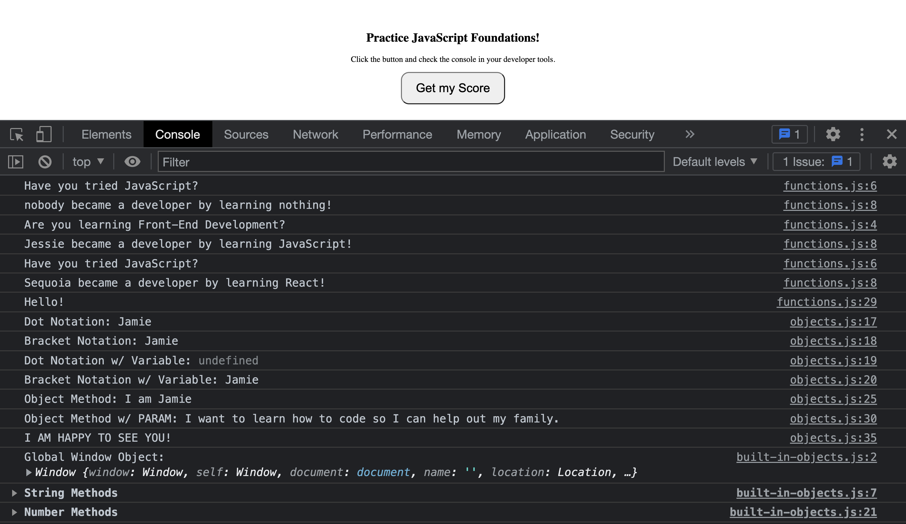

# JavaScript Foundations - Part 2

## Preparation

### GOALS

By the end of this lesson, you will be able to:

1. **Create JS Functions**
2. **Create JS Objects**
3. **Grasp Common JS Built-in Objects & Methods**

---



---

### CONCEPTS

- **Function:** A _function_ is a way to create an on-demand, reusable and executable code block.

- **Object:** Almost everything in JavaScript is an _object_. _Objects_ in a nutshell, are a set of self-contained key-value pairs.

---

---

## Walkthrough

### STEP 1: FUNCTIONS

**Aim**: Comprehend creating and using JavaScript Functions

| _./functions.js_ |

- [ ] **Creating Our First Function**
  - The purpose of functions is to create a block of code you can run anytime. Creating functions helps reduce the duplication of code and enhances the readability
  - You can replace multiple `console.log()` statements that say the same thing by creating a function that prints the statement and calling the function multiple times instead

```jsx
// console.log("You became a developer by learning with Codefi!")
// console.log("You became a developer by learning with Codefi!")
// console.log("You became a developer by learning with Codefi!")

// * FUNCTION DECLARATION (Generic) * \\
function learnToCode() {
  console.log("You became a developer by learning with Codefi!");
}

// * FUNCTION CALLS * \\
learnToCode();
learnToCode();
learnToCode();
```

🔻

- [ ] **Pass Parameters to a Function**
  - To add dynamic abilities to a function, it can accept an _argument_ and use that information inside to run differently depending on the parameter's value
  - Pass in a student variable, give it a default value of "someone"
  - Use a template literal to pass in the student's name with a string after
  - When you are calling the function, pass in a string for a student's name

```jsx
// * FUNCTION DECLARATION (Generic) * \\
function learnToCode(student = "someone") {
  console.log(`${student} became a developer by learning with Codefi!`);
}
```

🔻

- [ ] **Conditionalally Rendering a Statement Depending on an Argument**
  - Pass in a second variable `language` with a default value of "to code"
  - In the template literal string, use this argument to further the dynamic abilities
  - Use this argument to create a conditional statement
  - If the language is equal to JavaScript, render a different string

```jsx
// * FUNCTION DECLARATION (Generic) * \\
function learnToCode(student = "someone", language = "to code") {
  if (language.toLowerCase() === "javascript") {
    console.log("Are you learning Front-End Development?");
  } else {
    console.log("Have you tried JavaScript?");
  }
  console.log(`${student} became a developer by learning ${language}!`);
}
```

🔻

- [ ] **Functions with Return Values**
  - Create a new function `gradeAssignment(score = 0)` that takes in a score (default to 0) and returns that score
  - Call the function, pass in a score and save the result in a variable
  - `console.log()` the variable

```jsx
function gradeAssignment(score = 0) {
  return score;
}

const myTest = gradeAssignment(99);

console.log(myTest);
```

🔻

| _./index.html_ |

- [ ] **Call a Function Via Button Click**
  - Create a button that calls the `gradeAssignment()` function - pass in any score you want

```html
<!-- * MAIN CONTENT * -->
<section class="container">
  <h1>Practice JavaScript Foundations!</h1>
  <p>Click the button and check the console in your developer tools.</p>

  <button onclick="gradeAssignment(99)" class="btn-primary">
    Get my Score
  </button>
</section>
```

🔻

| _./functions.js_ |

- [ ] **Creating Anonymous Functions & ES6 Arrow Functions**
  - Create an anonymous function and store the value in a variable. _Note_: function variables can only be called AFTER they are declared
  - Practice ES6 arrow functions by refactoring the first two functions we created

```jsx
// * FUNCTION DECLARATION (ES6 ARROW) * \\
const learnToCodeES6 = (student, language) => {
  // Your Code Here
};

// * FUNCTION DECLARATION (ES6 ARROW) * \\
const gradeAssignmentES6 = score => {
  // Your Code Here
};

// * FUNCTION DECLARATION (Anonymous) * \\
const greet = function() {
  console.log("Hello");
};
```

🔻

**Check**: Assess your understanding of JavaScript functions.

- What is another name for a function parameter?
- How do you write an ES6 arrow function?
- When can you call a function before it is declared?

---

### STEP 2: OBJECTS

**Aim**: Comprehend Creating and Using JavaScript Objects

| _./objects.js_ |

- [ ] **Creating an Object**
  - Create an object that represents basic information on a single student

```jsx
const student = {
  name: "Jamie",
  shouldBuildProjects: true,
  age: 44
};
```

🔻

- [ ] **Accessing Object Properties**
  - To access, you can use the objects name followed by a `.` and then the property on the object
  - You can also use the [""] syntax, which is especially useful for variables
  - Create a separate variable that holds a string value of a property on the object
  - Try to use the dot notation and the bracket notation and see what the results are in your console

```jsx
// * ACCESSING an OBJECT * \\
const filterWord = "name";

console.log("Dot Notation:", student.name);
console.log("Bracket Notation:", student["name"]);
console.log("Dot Notation w/ Variable:", student.filterWord);
console.log("Bracket Notation w/ Variable:", student[filterWord]);
```

🔻

- [ ] **Creating & Calling a Method on an Object**
  - You can place functions inside of objects; these are called _methods_
  - Create a method that uses the `this` keyword to return a template literal statement of the student's name

```jsx
// * DECLARING an OBJECT * \\
const student = {
  name: "Jamie",
  shouldBuildProjects: true,
  age: 44,
  introduce: function() {
    return `I am ${this.name}`;
  }
};

// . . .

// * CALLING a METHOD on an OBJECT * \\
const sayHello = student.introduce();

console.log("Object Method:", sayHello);
```

🔻

- [ ] **Creating a Method that Takes in a Parameter**
  - Create another method on the `student` object that takes in a parameter and returns a template literal string using the argument passed into it

```jsx
// * DECLARING an OBJECT * \\
const student = {
  name: "Jamie",
  shouldBuildProjects: true,
  age: 44,
  introduce: function() {
    return `I am ${this.name}`;
  },
  motivate: function(reasonForLearningToCode) {
    return `I want to learn how to code so I can ${reasonForLearningToCode}`;
  }
};

// . . .
// * CALLING a METHOD w/ a PARAMETER on an OBJECT * \\
const findingYourWhy = student.motivate("help out my family.");

console.log("Object Method w/ PARAM:", findingYourWhy);
```

🔻

- [ ] **Global Methods for Different Data Types**
  - Almost everything in JavaScript is an object
  - Strings, Numbers, Objects, Arrays all have specific methods you can call on them because JS has an object with prebuilt methods for each data type

```jsx
// * GLOBAL METHODS PREVIEW * \\
const veryHappyGreeting = "I am happy to see you!".toUpperCase();

console.log(veryHappyGreeting);
```

🔻

**Check**: Assess your understanding of JavaScript objects

- How do you define key-value pairs in a JavaScript object?
- What object property notation would you use if you wanted to search using a separate variable?
- What is a function inside an object typically called?

---

### STEP 3: BUILT-IN OBJECTS

**Aim**: Comprehend the various built-in JavaScript objects

| _./built-in-objects.js_ |

- [ ] **Discovering the Global `window` object**
  - JavaScript requires a browser to run (we will learn about NodeJS later on), and so, every browser stores a global JS object
  - If you type window into your developer tools console, you can see all the methods and properties available to you.
  - Every time we create a function or object, it will be available on this global window object. Everything in the global object you can omit the window... it is implied

```jsx
console.log(window);
```

🔻

- [ ] **Introduce Common Built-in String Methods**
  - toUpperCase()
  - toLowerCase()
  - startsWith()
  - repeat()
  - trim()
  - charAt()
  - replace()
  - split()

```jsx
// * ===> COMMON BUILT-IN STRING METHODS <=== * \\
const myString = "       TESTING methods       ";

console.groupCollapsed("String Methods");
console.log("toUpperCase():", myString.toUpperCase());
console.log("toLowerCase():", myString.toLowerCase());
console.log("startsWith(' '):", myString.startsWith(" "));
console.log("trim():", myString.trim());
console.log("repeat():", myString.repeat(3));
console.log("charAt(9):", myString.charAt(9));
console.log("split('TESTING'):", myString.split("TESTING"));
console.log(
  "replace('methods', 'complete'):",
  myString.replace("methods", "complete")
);
console.groupEnd();
```

🔻

- [ ] **Introduce Common Built-in Number Methods**
  - toString()
  - Number.isInterger()
  - toFixed()
  - isNaN()

```jsx
// * ===> COMMON BUILT-IN NUMBER METHODS <=== * \\
const myNumber = 3.14159263;

console.groupCollapsed("Number Methods");
console.log("toString():", myNumber.toString());
console.log("Number.isInteger():", Number.isInteger(myNumber));
console.log("toFixed():", myNumber.toFixed(2));
console.log("isNaN():", isNaN(myNumber));
console.groupEnd();
```

🔻

- [ ] **Introduce Common Built-in Math Methods**
  - random()
  - floor()
  - ceil()
  - round()
  - min()
  - max()

```jsx
// * ===> COMMON BUILT-IN MATH METHODS <=== * \\
console.groupCollapsed("Math Methods");
console.log("random():", Math.random());
console.log("floor():", Math.floor(3.9));
console.log("ceil():", Math.ceil(3.1));
console.log("round():", Math.round(3.49));
console.log("min():", Math.min(2, 5, 1));
console.log("max():", Math.max(2, 5, 1));
console.groupEnd();
```

🔻

- [ ] **Introduce Common Built-in Date Methods**
  - now()
  - getDate()
  - toDateString()
  - toISOString()
  - getSeconds()
  - getMinutes()
  - getHours()
  - getDay()
  - getMonth()
  - getYear()

```jsx
// * ===> COMMON BUILT-IN DATE METHODS <=== * \\
console.groupCollapsed("Date Methods");
console.log("now():", Date.now());
console.log("getDate():", new Date().getDate());
console.log("toDateString():", new Date().toDateString());
console.log("toISOString():", new Date().toISOString());
console.log("getSeconds():", new Date().getSeconds());
console.log("getMinutes():", new Date().getMinutes());
console.log("getHours():", new Date().getHours());
console.log("getDay():", new Date().getDay());
console.log("getMonth():", new Date().getMonth());
console.log("getYear():", new Date().getYear());
console.groupEnd();
```

🔻

- [ ] **Introduce Common Built-in Document Methods**
  - title
  - URL
  - body
  - images
  - querySelector()
  - createElement()

```jsx
// * ===> COMMON BUILT-IN DOCUMENT METHODS <=== * \\
console.groupCollapsed("Document Methods");
console.log("title:", document.title);
console.log("URL:", document.URL);
console.log("body:", document.body);
console.log("images:", document.images);
console.log("querySelector():", document.querySelector("h1"));
console.log("createElement():", document.createElement("h1"));
console.groupEnd();
```

🔻

- [ ] **Introduce Common Built-in Array Methods**
  - length
  - push()
  - pop()
  - includes()
  - indexOf()

```jsx
// * ===> COMMON BUILT-IN ARRAY METHODS <=== * \\
const myArray = [1, "Hello", false, 20, true];

console.groupCollapsed("Array Methods");
console.log("length:", myArray.length);
console.log("push():", myArray.push("Last Item"));
console.log("pop():", myArray.pop());
console.log("includes():", myArray.includes("Hello"));
console.log("indexOf():", myArray.indexOf("Hello"));
console.groupEnd();
```

- [ ] **Future Array Methods We Will Learn**
  - forEach()
  - slice()
  - splice()
  - filter()
  - map()
  - sort()
  - every()
  - some()
  - reduce()

🔻

**Check**: Assess your understanding of JavaScript built-in objects

- How would you turn an all-caps string into a lower case string?
- How would you remove all preceding and trailing whitespace in a string?
- How would you turn the number 10.2132130 into 10.21?
- How do you create a random number in JavaScript?
- How do you get the Date?
- What method do you call to grab the title of the document?
- How do you check the overall length of an array?
- How do you take off the last element in an array?

---

---

## Review

### ACCOMPLISHMENTS

Congratulations yet again! 🎊🎉

Feel proud that **you learned something new and valuable today**.

Learning to code is a journey, and you are taking the necessary steps to improve your skills and opportunities for the future.

_Good on you!_

Specifically, we learned how to:

- Create functions in old and modern fashion
- Code custom objects and understand their capabilities
- Recognize and use everyday built-in JavaScript objects

---

### RESOURCES

[JavaScript Fundamentals - Functions _(Article)_](https://javascript.info/function-basics)

[JavaScript Functions: Explain Like I'm Five _(Article)_](https://dev.to/sumusiriwardana/javascript-functions-explain-like-i-m-five-5009)

[Modern JavaScript Tutorial #5 - Objects _(Video)_](https://www.youtube.com/watch?v=X0ipw1k7ygU&ab_channel=TheNetNinja)

---

---
