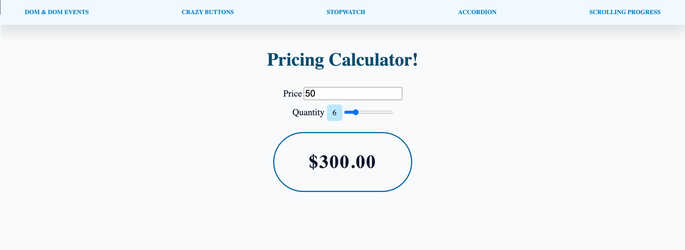
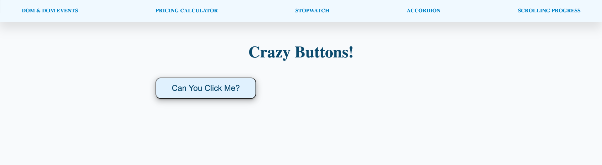
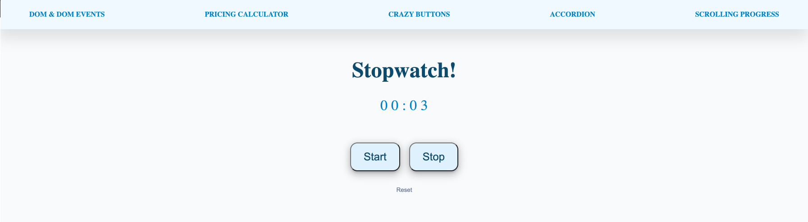
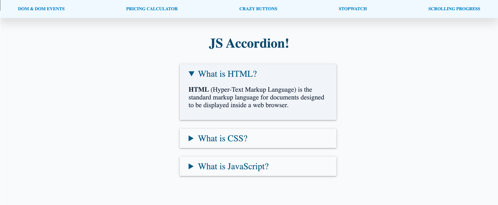
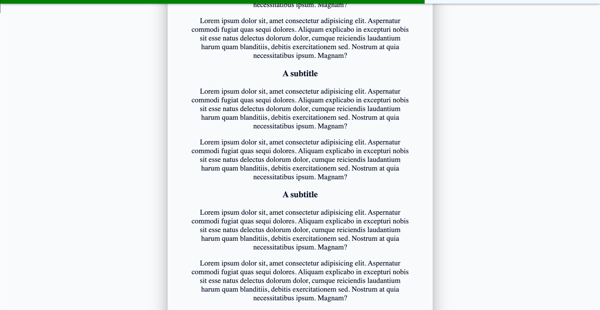

# Building Real Things

[View Class 4 Projects Online Here](https://codefi-bootcamp-class-4.netlify.app/)

## Preparation

### GOALS

By the end of this lesson, you will be able to:

1. **Use and Manipulate the DOM**
2. **Develop a Crazy Button**
3. **Build a Pricing Calculator**
4. **Make a JS Stopwatch**
5. **Create an HTML Accordion Menu**
6. **Code a JavaScript Progress Bar**

---

**JavaScript DOM**


**JavaScript Pricing Calculator**


**JavaScript Crazy Buttons**


**JavaScript Stopwatch**


**HTML Accordion Menu**


**JavaScript Scrolling Progress**


---

### CONCEPTS

- **DOM:** The _DOM_ or _Document Object Model_ is a built-in HTML API that defines the document's logical structure in object format for easily creating or manipulating elements

- **Event Listener:** An _event listener_ is an interface for an object that can dispatch event methods on an "EventTarget" object

---

---

## Walkthrough

### STEP 1: DOM & DOM EVENTS

**Aim**: Create buttons that change the background of the document in three different ways

- Look through the JavaScript document object

| _./dom.html_ |

- [ ] **Add an `onclick` event to the first button**
  - Walkthrough the code we have
  - Add an `onclick` event to call a function in JavaScript to update the background

```html
<!-- Button 1: inline HTML -->
<button class="btn btn_inline" onclick="changeBackground()">Button 1</button>
```

🔻
| _./dom.js_ |

- [ ] **Create a function that changes the background of the document**

  - Create a new function
  - Inside that function, change the `body.style.backgroundColor` to "#bae6fd"

- _NOTE_: it is cleanest to have all the functionality in JavaScript (separation of concerns)

```jsx
// * Inline HTML * \\
function changeBackground() {
  document.body.style.backgroundColor = "#bae6fd";
}
```

🔻

- [ ] **Change background on a single button using JavaScript onclick property**
  - Create a new variable to select the second button
  - Set the `.onclick` property on the variable equal to a function that changes the body's background to "#a7f3d0"

```jsx
// * JavaScript button onclick property * \\
const javascriptSingleButton = document.querySelector(".btn_onclick");

javascriptSingleButton.onclick = function() {
  document.body.style.backgroundColor = "#a7f3d0";
};
```

🔻

- [ ] **Change background on multiple buttons dynamically using JavaScript onclick properties**
  - Change the `querySelector` to `querySelectorAll`
  - Use the `forEach` method to loop over all the buttons in the node list and set the body's background style

```jsx
// * JavaScript button onclick properties * \\
const javascriptMultipleButtons = document.querySelectorAll(".btn_onclick");

javascriptMultipleButtons.forEach(button => {
  button.onclick = function() {
    document.body.style.backgroundColor = "#a7f3d0";
  };
});
```

🔻

- [ ] **Code a function to change the background to a random color**
  - Create a function that generates a random hexadecimal value
  - Set the documents body's background color to the random value

```jsx
// * JavaScript Event listener * \\
function changeBgToRandom() {
  const randomColor = Math.floor(Math.random() * 16777215).toString(16);

  document.body.style.backgroundColor = `#${randomColor}`;
}
```

🔻

- [ ] **Add event listeners that call the `changeBgToRandom` function**
  - Create a variable that selects the fifth button
  - Add an event listener to the variable, listen for the "click" event, and call the `changeBgToRandom` function
  - Add an event listener to the variable, listen for the "mouseenter" event, and call the `changeBgToRandom` function

```jsx
// * JavaScript Event listener * \\
function changeBgToRandom() {
  const randomColor = Math.floor(Math.random() * 16777215).toString(16);

  document.body.style.backgroundColor = `#${randomColor}`;
}

const eventListenerButton = document.querySelector(".btn_event-listener");
eventListenerButton.addEventListener("click", changeBgToRandom);
eventListenerButton.addEventListener("mouseenter", changeBgToRandom);
```

🔻

**Check**: Ensure each button does what we expect

- Does the first button change the background color to "#bae6fd"?
- Do the second, third, and fourth buttons change the color to "#a7f3d0"?
- Does the fifth button change the background to a random color on hover and mouse click?

---

### STEP 2: PRICING CALCULATOR

**Aim**: Create a JavaScript calculator that takes in a price and quantity and displays the total

| _./pricing-calculator.html_ |

- [ ] **Build out the HTML**
  - Create an input + label for the price
  - Create an input + label for the quantity
  - Below the form, create a place to display the total price

```html
<!-- * MAIN CONTENT * -->
<main class="container">
  <h1>Pricing Calculator!</h1>

  <!-- User Input Form -->
  <form class="pricing-form">
    <!-- Price -->
    <div>
      <label for="price">Price</label>
      <input type="number" name="price" id="price" value="50" min="0" />
    </div>

    <!-- Quantity -->
    <div>
      <label for="quantity"
        >Quantity <span class="quantity-label"></span
      ></label>
      <input
        type="range"
        name="quantity"
        id="quantity"
        value="1"
        min="1"
        max="25"
        step="1"
      />
    </div>
  </form>

  <!-- Data Display -->
  <section class="data-display"><p class="total-price"></p></section>
</main>
```

🔻

| _./pricing-calculator.js_ |

- [ ] **Establish the Element Selectors**
  - Create a variable for the price input
  - Create a variable for the quantity input
  - Create a variable for the total price display

```jsx
// * ========== HTML Element Selectors ========== * \\
const priceInput = document.querySelector("#price");
const quantityInput = document.querySelector("#quantity");
const totalPriceDisplay = document.querySelector(".total-price");
```

🔻

- [ ] **Initiate the Event Listeners**
  - Create an event listener for the price input change that calls the `calculateTotalCost` function
  - Create an event listener for the quanitity input change that calls the `calculateTotalCost` function

```jsx
// * ========== Event Listeners ========== * \\
// EVENT LISTENER: Calculate Total Cost When Price Input Changes
priceInput.addEventListener("input", calculateTotalCost);

// EVENT LISTENER: Calculate Total Cost When Quantity Input Changes
quantityInput.addEventListener("input", calculateTotalCost);
```

🔻

- [ ] **Declare the Functions**
  - Create a variable that holds the total price
  - Check this value in the console
  - Display this total to the webpage

```jsx
// * ========== Function Declarations ========== * \\
// FUNCTION: Calculate total Cost
function calculateTotalCost() {
  const total = priceInput.value * quantityInput.value;
  totalPriceDisplay.innerText = `$${total.toFixed(2)}`;
}
```

🔻

- [ ] **Generate the Total Cost on Application Start**

```jsx
// * ========== Application Start ========== * \\
// Calcualte the Total Cost When the Application Starts
calculateTotalCost();
```

🔻

- [ ] **Construct a Quantity Label**
  - Create a variable that represents the quantity label paragraph
  - Create a function that uses the quantity inputs value to set the innerText
  - Add an event listener to the input that updates the quantity label
  - Call the function on application load

```jsx
// * ========== HTML Element Selectors ========== * \\
// . . .
const quantityLabel = document.querySelector(".quantity-label");

// * ========== Function Declarations ========== * \\
// . . .

// FUNCTION: Update Quantity Label
function updateQuantityLabel() {
  const quantity = quantityInput.value;
  quantityLabel.innerText = quantity;
}

// * ========== Event Listeners ========== * \\
// . . .

// EVENT LISTENER: Update Quantity Label When Quantity Input Changes
quantityInput.addEventListener("input", updateQuantityLabel);

// * ========== Application Start ========== * \\
// . . .

// Update the Quantity Label When the Application Starts
updateQuantityLabel();
```

🔻

**Check**: Ensure the math is correct

- Does the total price show $100 for a price of $50 and a quantity of 2?
- Does the total price show $625 for a price of $25 and a quantity of 25?

---

### STEP 3: CRAZY BUTTONS

**Aim**: Create a button that moves whenever a user tries to hover over the button

| _./crazy-buttons.html_ |

- [ ] **Build out the HTML**
  - Create a section which contains a button of type button

```html
<!-- * MAIN CONTENT * -->
<main class="container">
  <h1>Crazy Buttons!</h1>

  <section>
    <button type="button" class="btn crazy-button">Can You Click Me?</button>
  </section>
</main>
```

🔻

| _./crazy-buttons.js_ |

- [ ] **Establish the Element Selectors**
  - Create a variable `crazyButton` that stores a reference to the HTML button

```jsx
// * ========== HTML Element Selectors ========== * \\
const crazyButton = document.querySelector(".crazy-button");
```

🔻

- [ ] **Initiate the Event Listeners**
  - Add an Event Listener to the "crazyButton" that calls a `goBtnWild` function on "mouseenter"

```jsx
// * ========== Event Listeners ========== * \\
// EVENT LISTENER: Listens for the mouse to hover the "crazyButton" and calls "goBtnWild()"
crazyButton.addEventListener("mouseenter", goBtnWild);
```

🔻

- [ ] **Declare the Functions**
  - Create the `goBtnWild` function
  - Get a random position inside of the user's window for height
  - Get a random position inside of the user's window for width

```jsx
// * ========== Function Declarations ========== * \\
// FUNCTION: Gets a random position on screen and sets the button to that location
function goBtnWild() {
  const offsetTop =
    Math.random() * (window.innerHeight - crazyButton.clientHeight);
  const offsetLeft =
    Math.random() * (window.innerWidth - crazyButton.clientWidth);
}
```

🔻

- [ ] **Add Functionality**
  - Use those offsets to change the `style` properties on the `crazyBtn`

```jsx
// * ========== Function Declarations ========== * \\
// FUNCTION: Gets a random position on screen and sets the button to that location
function goBtnWild() {
  const offsetTop =
    Math.random() * (window.innerHeight - crazyButton.clientHeight);
  const offsetLeft =
    Math.random() * (window.innerWidth - crazyButton.clientWidth);

  crazyButton.style.top = offsetTop + "px";
  crazyButton.style.left = offsetLeft + "px";
}
```

🔻

**Check**: Ensure the button runs away from the mouse

- Can you click the button?

---

### STEP 4: STOPWATCH

**Aim**: Create a stopwatch using JavaScript with start, stop, and reset buttons

| _./stopwatch.html_ |

- [ ] **Build out the HTML**
  - Create a section to display the timer's time
  - Create a section that holds the three buttons (start, stop, reset)

```html
<!-- * MAIN CONTENT * -->
<main class="container">
  <h1>Stopwatch!</h1>

  <article>
    <!-- Timer Display -->
    <section class="timer">
      <p>
        <span class="minutes">0 0</span> : <span class="seconds">0 0</span>
      </p>
    </div>

    <!-- Timer Buttons -->
    <section class="timer-buttons">
      <div>
        <button data-action="start" class="btn btn-start">Start</button>
        <button data-action="stop" class="btn btn-stop">Stop</button>
      </div>

      <button data-action="reset" class="btn-reset">Reset</button>
    </section>
  </article>
</main>
```

🔻

| _./stopwatch.js_ |

- [ ] **Establish the Element Selectors**
  - Grab all the elements we need from the HTML and store them in their respective variables

```jsx
// * ========== HTML Element Selectors ========== * \\
const startButton = document.querySelector("[data-action='start']");
const stopButton = document.querySelector("[data-action='stop']");
const resetButton = document.querySelector("[data-action='reset']");
const minutesDisplay = document.querySelector(".minutes");
const secondsDisplay = document.querySelector(".seconds");
```

🔻

- [ ] **Initiate the Event Listeners**
  - Create event listeners for the start, stop, and reset buttons that call their respective functions on "click"

```jsx
// * ========== Event Listeners ========== * \\
// EVENT LISTENER: Listens for a click on the start button to start the timer
startButton.addEventListener("click", startTimer);

// EVENT LISTENER: TSListens for a click on the stop button to stop the timer
stopButton.addEventListener("click", stopTimer);

// EVENT LISTENER: Listens for a click on the reset button to reset the timer
resetButton.addEventListener("click", resetTimer);
```

🔻

- [ ] **Declare the Functions**

```jsx
// * ========== Function Declarations ========== * \\
// FUNCTION: Starts the timer
function startTimer() {}

// FUNCTION: Stops the timer
function stopTimer() {}

// FUNCTION: Resets the timer
function resetTimer() {}
```

🔻

- [ ] **Define the Global Variables**

```jsx
// * ========== Global Variables ========== * \\
let currTime = 0;
```

🔻

- [ ] **Start an Interval when the `startTimer` function is called**

```jsx
// FUNCTION: Starts the timer
function startTimer() {
  setInterval(() => {
    // Increment the current time variable
    currTime++;

    // Get the formatted seconds and minutes based on the current time
    const { minutes, seconds } = getFormattedTime(); // { minutes: 1, seconds: 30 }

    // Display the time to the screen
    displayFormattedTime(minutes, seconds);
  }, 1000);
}
```

🔻

- [ ] **Calculate & Display the formatted time in the browser**

```jsx
// FUNCTION: Helper Function to format time into proper text
function getFormattedTime() {
  let min = Math.floor(currTime / 60);
  let sec = currTime % 60;

  return {
    minutes: min < 10 ? `0 ${min}` : min,
    seconds: sec < 10 ? `0 ${sec}` : sec
  };
}

// FUNCTION: Helper function ot display the formatted time to the correct HTML element
function displayFormattedTime(minutes, seconds) {
  minutesDisplay.innerText = minutes;
  secondsDisplay.innerText = seconds;
}
```

🔻

- [ ] **Refactor your solution**

```jsx
// FUNCTION: Start an Interval that increases the global timer variable by 1 every second
function incrementTime() {
  // Increment the current time variable
  currTime++;

  // Get the formatted seconds and minutes based on the current time
  const { minutes, seconds } = getFormattedTime(); // { minutes: 1, seconds: 30 }

  // Display the time to the screen
  displayFormattedTime(minutes, seconds);
}
```

🔻

- [ ] **Add Logic to the Functions**
  - Create two new global variables
  - Check if the timer is running and have code dependant on that state
  - Set and Clear the interval in the start and stop functions
  - Have the reset function stop the timer and reset the inputs

```jsx
// * ========== Global Variables ========== * \\
let currTime = 0;
let isRunning = false;
let timerInterval;

// * ========== Function Declarations ========== * \\
// FUNCTION: Starts the timer
function startTimer() {
  // If there was a previous timer, don't create another new timer
  if (isRunning) return;

  isRunning = true;
  timerInterval = setInterval(incrementTime, 1000);
}

// FUNCTION: Stops the timer
function stopTimer() {
  // If there wasn't a previous timer, don't do anything
  if (!isRunning) return;

  isRunning = false;
  clearInterval(timerInterval);
}

// FUNCTION: Resets the timer
function resetTimer() {
  stopTimer();

  currTime = 0;
  displayFormattedTime("0 0", "0 0");
}
```

🔻

**Check**: Ensure the stopwatch works as intended

- Can you start the stopwatch?
- When you pause a running stopwatch and start again, does the counter increase at a normal pace?
- When you click the reset button, does the input look the same as if you refreshed the page?

---

### STEP 5: ACCORDION

**Aim**: Create an Accordion menu using HTML

| _./accordion.html_ |

- [ ] **Build out the HTML**
  - Create an article that holds three `<details>` tags and their `<summary>` & `<p>` content

```html
<!-- * MAIN CONTENT * -->
<main class="container">
  <h1>JS Accordion!</h1>

  <article class="accordion-container">
    <details>
      <summary>What is HTML?</summary>
      <p>
        <strong>HTML</strong> (Hyper-Text Markup Language) is the standard
        markup language for documents designed to be displayed inside a web
        browser.
      </p>
    </details>
    <details>
      <summary>What is CSS?</summary>
      <p>
        <strong>CSS</strong> (Cascading Style Sheets) is a style sheet language
        used for describing the presentation of a document written in a markup
        language such as HTML.
      </p>
    </details>
    <details>
      <summary>What is JavaScript?</summary>
      <p>
        <strong>JavaScript</strong> is a dynamic programming language used for
        web development, software applications, game creation, machine learning,
        and more.
      </p>
    </details>
  </article>
</main>
```

🔻

| _./accordion.css_ |

- [ ] **Style the Container**

```css
.accordion-container {
  display: flex;
  flex-direction: column;
  width: clamp(250px, 30%, 500px);
  margin: 1em auto;
}
```

🔻

- [ ] **Style the Toggles & Content**

```css
details {
  width: 100%;
  text-align: left;
  margin: 1em 0;
  padding: 1em 2em;
  box-shadow: 0px 2px 5px 0px rgba(0, 0, 0, 0.14), 0px 1px 10px 0px rgba(0, 0, 0, 0.12),
    0px 2px 4px -1px rgba(0, 0, 0, 0.2);
}

details[open] {
  background-color: #f1f5f9;
}

summary {
  color: #075985;
  font-size: 2rem;
  cursor: pointer;
}

details p {
  font-size: 1.5rem;
  color: #1e293b;
}
```

🔻

**Check**: Ensure the menu's toggle

- Can you click on the element to open its summary and content?
- Can you tab through the menu effectively?

---

### STEP 6: SCROLLING PROGRESS

**Aim**: Create a progress bar that shows how far a user is down the page

| _./scrolling-progress.html_ |

- [ ] **Build out the HTML**
  - Create the label and an HTML progress bar elements

```html
<h1>Scrolling Progress Bar!</h1>

<!-- Progress Bar -->
<label
  for="progress-bar"
  class="sr-only"
  aria-label="See the progress of your reading"
  >Reading Progress</label
>
<progress class="progress-bar" id="progress-bar" value="0" max="100"></progress>

<!-- . . . -->
```

🔻

| _./scrolling-progress.css_ |

- [ ] **Walkthrough the CSS**
  - Talk about the blog post container styles
  - Show the progress bar styles
  - Talk about accessibility and the "sr-only" class

```css
/* * Scrolling Progress * */
.blog-post {
  width: clamp(275px, 50%, 60ch);
  margin: 1em auto;
  font-size: 1.375rem;
  padding: 0.125em 3em;
  border-radius: 12px;
  box-shadow: 0px 24px 38px 3px rgba(0, 0, 0, 0.14), 0px 9px 46px 8px rgba(0, 0, 0, 0.12),
    0px 11px 15px -7px rgba(0, 0, 0, 0.2);
}

.progress-bar {
  height: 0.75rem;
  width: 100vw;

  position: sticky;
  top: 0;
  left: 0;
  display: none;
  /* Reset the default appearance */
  -webkit-appearance: none;
  appearance: none;
}
progress[value]::-webkit-progress-bar {
  background-color: #f0f9ff;
  border-radius: 2px;
  box-shadow: 0px 2px 5px 0px rgba(0, 0, 0, 0.14), 0px 1px 10px 0px rgba(0, 0, 0, 0.12),
    0px 2px 4px -1px rgba(0, 0, 0, 0.2);
}

.sr-only {
  position: absolute;
  width: 1px;
  height: 1px;
  padding: 0;
  margin: -1px;
  overflow: hidden;
  clip: rect(0, 0, 0, 0);
  white-space: nowrap; /* added line */
  border: 0;
}
```

🔻

| _./scrolling-progress.js_ |

- [ ] **Establish the Element Selectors**

```jsx
// * ========== HTML Element Selectors ========== * \\
const progressBar = document.querySelector("#progress-bar");
```

🔻

- [ ] **Initiate the Event Listeners**

```jsx
// * ========== Event Listeners ========== * \\
// EVENT LISTENER: Listens for a scroll on the window of the screen to fill the progress bar
window.addEventListener("scroll", fillProgressBar);
```

🔻

- [ ] **Declare the Function**

```jsx
// * ========== Function Declarations ========== * \\
// FUNCTION: Fills the progress bar
function fillProgressBar() {
  const windowHeight = window.innerHeight;
  const fullHeight = document.body.clientHeight;
  const scrolled = window.scrollY;
}
```

🔻

- [ ] **Add Conditional Styles**
  - Only display the progress bar if we are over 25% scrolled

```jsx
// FUNCTION: Fills the progress bar
function fillProgressBar() {
  // . . .

  const percentScrolled = (scrolled / (fullHeight - windowHeight)) * 100;

  percentScrolled > 25
    ? (progressBar.style.display = "block")
    : (progressBar.style.display = "none");

  progressBar.value = percentScrolled;
}
```

🔻

**Check**: Ensure the progress bar presents accurate data

- Does the progress bar stick to the top of the screen?
- Does the progress bar show 100% complete at the bottom of the page?
- Does the progress bar disappear when you are at the top of the page?

---

---

## Review

### ACCOMPLISHMENTS

Congratulations yet again! 🎊🎉

Feel proud that **you learned something new and valuable today**.

Learning to code is a journey, and you are taking the necessary steps to improve your skills and opportunities for the future.

_Good on you!_

Specifically, we learned how to:

- Work with the DOM and use DOM Events to run JavaScript code
- Add HTML semantic elements for forms, content, and structure
- Work with new CSS selectors and properties to effectively add styles to our website

---

### RESOURCES

[Vanilla JavaScript Quick Reference / Cheatsheet _(Repository)_](https://gist.github.com/thegitfather/9c9f1a927cd57df14a59c268f118ce86)

---

---
