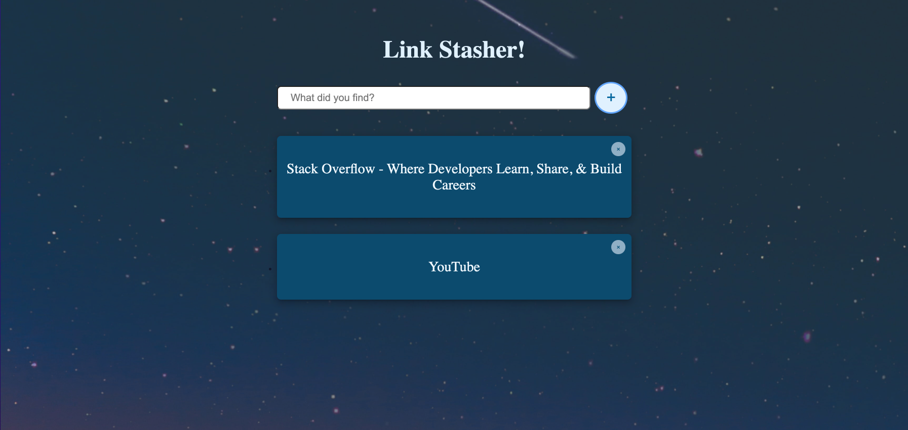

# Bookmarking App

## Preparation

### GOALS

By the end of this lesson, you will be able to:

1. **Create Floating Inputs**
2. **Utilize Local Storage**
3. **Fetch Data from an API**

---

**JavaScript Bookmark Application**


---

### CONCEPTS

- **Local Storage:** _Local Storage_ is a type of web storage located in the browser that persists data even after page reload

- **API:** An _API (Application Programming Interface)_ is a software intermediary that allows two applications to talk to each other

---

---

## Walkthrough

### STEP 1: FLOATING INPUT

**Aim**: Create the main layout, styles, and basic form functionality for the application

| _./index.html_ |

- [ ] **Build out the HTML**
  - Create a title
  - Create an overlay div
  - Create a form with a lable, input, and button
  - Link to the CSS & JavaScipt files

```html
<!DOCTYPE html>
<html lang="en">
  <head>
    <meta charset="UTF-8" />
    <meta http-equiv="X-UA-Compatible" content="IE=edge" />
    <meta name="viewport" content="width=device-width, initial-scale=1.0" />
    <title>Link Stasher | Save Links & Clear Your Mind!</title>
    <link rel="stylesheet" href="styles.css" />
  </head>
  <body>
    <!-- * MAIN CONTENT * -->
    <main class="container">
      <!-- Title -->
      <h1>Link Stasher!</h1>

      <!-- Overlay -->
      <div class="overlay"></div>

      <!-- Input Form -->
      <form id="link-form">
        <label for="link" class="sr-only">Enter Your Link</label>
        <input
          class="link-input"
          type="text"
          id="link"
          name="link"
          placeholder="What did you find?"
        />
        <button type="submit" class="btn" aria-label="Add new link">
          &plus;
        </button>
      </form>
    </main>

    <!-- * JAVASCRIPT * -->
    <script src="./app.js"></script>
  </body>
</html>
```

🔻

| _./styles.css_ |

- [ ] **Style the main container**
  - Add the container style to take full width & height
  - Find an image on unsplash.com and save it locally
  - Use the image to be a background for the page

```css
.container {
  text-align: center;
  background: url("./images/night-sky_bg.jpg") no-repeat center/cover;
  min-height: 100vh;
  width: 100vw;
}
```

🔻

- [ ] **Style the form and input**

```css
form {
  position: relative;
  display: flex;
  align-items: center;
  justify-content: center;
  width: clamp(275px, 50%, 700px);
  margin: 0 auto;
}

.link-input {
  padding: 0.5em 1.25em;
  font-size: 1.25rem;
  border-radius: 8px;
  width: 100%;
}
```

🔻

- [ ] **Style the overlay**

```css
.overlay {
  position: fixed;
  top: 0%;
  left: 0%;
  background-color: rgba(0, 0, 0, 0.8);
  width: 100%;
  height: 100%;
  opacity: 0;

  transition: 300ms ease opacity;
}
```

🔻

- [ ] **Style the body when the form is focused**
  - Add body styles for the form, input, and overlay
  - Add transitions

```css
body.focus-form form {
  transform: scale(1.1);
}
body.focus-form .link-input {
  padding: 0.75em 1.5em;
  font-size: 1.5rem;
}
body.focus-form .overlay {
  opacity: 1;
}
// . . .
form {
  // . . .
  transition: 500ms cubic-bezier(0.17, 0.67, 0.35, 1.6) opacity;
}

.link-input {
  // . . .
  transition: 500ms cubic-bezier(0.17, 0.67, 0.35, 1.6) all;
}
```

🔻

| _./app.js_ |

- [ ] **Establish the Element Selectors**
  - Create a variable for the body element
  - Create a variable for the input element
  - Create a variable for the overlay element

```jsx
// * ========== HTML Element Selectors ========== * \\
const body = document.body;
const input = document.querySelector(".link-input");
const overlay = document.querySelector(".overlay");
```

🔻

- [ ] **Initiate the Event Listeners**
  - Create an event listener on the input's "focus" event
  - Create an event listener on the overlay's "click" event

```jsx
// * ========== Event Listeners ========== * \\
// EVENT LISTENER: Listens for "focus" event on the "input" and runs the "focusInput" function
input.addEventListener("focus", focusInput);
// EVENT LISTENER: Listens for "click" event on the "overlay" and runs the "endFocus" function
overlay.addEventListener("click", endFocus);
```

🔻

- [ ] **Declare the Functions**
  - Create the `focusInput` function
  - Creat the `endFocus` function

```jsx
// * ========== Function Declarations ========== * \\
// FUNCTION: Adds the "focus-form" class on the body when the form is in focus
function focusInput() {
  body.classList.add("focus-form");
}

// FUNCTION: Removes the "focus-form" class on the body when the form is out of focus
function endFocus() {
  if (body.classList.contains("focus-form"))
    body.classList.remove("focus-form");
}
```

🔻

- [ ] **Split the input Event Listener**
  - Create an event listener on the input for the "focusin" event
  - Create an event listener on the input for the "focusout" event

```jsx
// * ========== Event Listeners ========== * \\
// EVENT LISTENER: Listens for "focusin" event on the "input" and runs the "focusInput" function
input.addEventListener("focusin", focusInput);
// EVENT LISTENER: Listens for "focusout" event on the "input" and runs the "endFocus" function
input.addEventListener("focusout", endFocus);
// . . .
```

🔻

**Check**: Ensure the input field is working correctly

- Does the overlay take up the whole screen?
  When you click or tab into the input, does the overlay show, and does the form gets larger?

---

### STEP 2: SHOWING BOOKMARKS

**Aim**: Dynamically display a list of links

| _./index.html_ |

- [ ] **Create a place for an HTML list to live**

```html
<!-- Link List -->
<ul class="link-list">
  <!-- <li>
          <a class="link" href="/">This is a test link</a>
        </li>
        <li>
          <a class="link" href="/">This is a test link</a>
        </li> -->
</ul>
```

🔻

- [ ] **Style the link list container**

```css
.link-list {
  position: relative;
  width: clamp(275px, 50%, 700px);
  margin: 2em auto 0 auto;
  padding: 0 0 5em 0;
}
```

🔻

- [ ] **Style the list item and link**

```css
.link-list li {
  position: relative;
  width: 100%;
  margin: 2em 0;
  background-color: #0c4a6e;
  border-radius: 8px;
  box-shadow: 0px 8px 17px 2px rgba(0, 0, 0, 0.14), 0px 3px 14px 2px rgba(0, 0, 0, 0.12),
    0px 5px 5px -3px rgba(0, 0, 0, 0.2);

  transition: 350ms ease all;
}

.link {
  display: block;
  color: #f0f9ff;
  text-decoration: none;
  font-size: 1.75rem;
  padding: 1.75em 0;
  cursor: pointer;
}
```

🔻

- [ ] **Add Hover Styles**

```css
.link-list li:hover,
.link-list li:focus {
  background-color: #0369a1;
  box-shadow: 0px 16px 24px 2px rgba(0, 0, 0, 0.14), 0px 6px 30px 5px rgba(0, 0, 0, 0.12),
    0px 8px 10px -7px rgba(0, 0, 0, 0.2);
}
```

- Comment out the dummy list items in the HTML

🔻

| _./app.js_ |

- [ ] **Establish the Element Selectors**
  - Create a variable for the form container
  - Create a variable for the link-list container

```jsx
// * ========== HTML Element Selectors ========== * \\
// . . .

const form = document.querySelector("#link-form");
const linkList = document.querySelector(".link-list");
```

🔻

- [ ] **Initiate the Event Listeners**
  - Create an event listener for the form submission that calls the `createLink` function

```jsx
// _ ========== Event Listeners ========== _ \\
// . . .

// EVENT LISTENER: Listens for "submit" event on the "form" and runs the "createLink" function
form.addEventListener("submit", createLink);
```

🔻

- [ ] **Declare the Functions**
  - Create a function that creates a new link based on a URL

```jsx
// _ ========== Function Declarations ========== _ \\
// FUNCTION: Creates a new Link when a URL is submitted
function createLink(e) {
  // prevents the form from submitting
  e.preventDefault();

  // Grab info from input box
  const url = input.value;
}
```

🔻

- [ ] **Finish out the logic for the `createLink` function**
  - Create a list item
  - Create an anchor tag
  - Add the innerText, href, and target attributes
  - append the elements together
  - reset the form

```jsx
function createLink(e) {
  // . . .

  // Create a new bookmark
  const linkContainer = document.createElement("li");
  const newLink = document.createElement("a");
  newLink.className = "link";
  newLink.innerText = url;
  newLink.href = url;
  newLink.target = "_blank";

  // console.log("newLink:", newLink);

  // Dynamically insert into HTML
  linkContainer.appendChild(newLink);
  linkList.appendChild(linkContainer);

  // Reset the input box
  form.reset();
}
```

🔻

**Check**: Ensure adding a URL works correctly

- Can you type a URL into the box and view it below the form?

---

### STEP 3: LOCAL STORAGE

**Aim**: Save the link list in local storage and pull in data on application load

| _./app.js_ |

- [ ] **Create the Bookmarks array**

```jsx
// _ ========== Global Variables ========== _ \\
const allLinks = [];
```

🔻

- [ ] **Push the URL every time a user adds a link**

```jsx
// FUNCTION: Creates a new Link when a URL is submitted
function createLink(e) {
  // . . .

  // Add new Link to allLinks array
  allLinks.push(url);

  // . . .
}
```

🔻

- [ ] **Refactor solution to loop over the links one by one**

```jsx
// . . .

// Repopulate HTML List
populateLinkList(allLinks);

// . . .
}

// . . .

// FUNCTION: Populates HTML with a list of Bookmarks
function populateLinkList(links = []) {
  // Loop over all links and create a new bookmark for each element
  linkList.innerHTML = links
    .map(
      (link) =>
        ` <li> <a class="link" href=${link} target="_blank" >${link}</a> </li>`
    )
    .join("");
}
```

🔻

- [ ] **Save the new links to localStorage**

```jsx
function createLink(e) {
  // . . .

  // Save List to Local Storage
  saveLinkListToLocalStorage(allLinks);

  // . . .
}

// . . .

// FUNCTION: Saves Link List in Local Storage
function saveLinkListToLocalStorage(links = []) {
  localStorage.setItem("link_list", JSON.stringify(links));
}
```

🔻

- [ ] **Pull from localStorage on application Load**
  - Call the `populateLinkList(allLinks)` on application load
  - Populate `allLinks` array with localStorage if available

```jsx
// _ ========== Global Variables ========== _ \\
const allLinks = JSON.parse(localStorage.getItem("link_list")) || [];

// . . .

// _ ========== On Application Start ========== _ \\
populateLinkList(allLinks);
```

🔻

**Check**: Ensure localStorage is hooked up correctly

- When you add a link, does it stay if you refresh the page?

---

### STEP 4: (OPTIONAL) - DELETING BOOKMARKS

**Aim**: Add the functionality to delete bookmarks

| _./styles.css_ |

- [ ] **Style the close button**
  - Add the styles for the close button
  - Add `position: relative` to the main list item
  - Add the close button hover and focus states

```css
.link-list li {
  position: relative;
  // . . .
}

// . . .

.close-btn {
  position: absolute;
  top: 12px;
  right: 12px;
  border-radius: 50%;
  padding: 0.5em 0.75em;
  border: none;
  color: #075985;
  background-color: #e0f2fe;
  opacity: 0.6;
  cursor: pointer;
  transition: 300ms ease all;
}
.close-btn:hover,
.close-btn:focus {
  opacity: 1;
  transform: scale(1.1);
}
```

🔻

| _./app.js_ |

- [ ] **Add the close button whenever generating a new link item**
  - Add the close button
  - Add the data index property

```jsx
function populateLinkList(links = []) {
  // Loop over all links and create a new bookmark for each element
  linkList.innerHTML = links
    .map(
      (link, idx) => `
      <li data-index=${idx}>
        <a class="link" href=${link.url} target="_blank" >${link.title}</a>
        <button class="close-btn">&times;</button>
      </li>`
    )
    .join("");
}
```

🔻

- [ ] **Listen for a "click" on the Link List**

```jsx
// _ ========== Event Listeners ========== _ \\
// . . .

// EVENT LISTENER: Listens for "click" event on the "linkList" and runs the "removeLink" function
linkList.addEventListener("click", removeLink);
```

🔻

- [ ] **Add the Logic to remove a list item based on index**
  - Ensure we are clicking on the "x"
  - Find the index of the element
  - Remove the link from the list
  - Repopulate the list
  - Save to localStorage

```jsx
// FUNCTION: Removes a new Link when a link is deleted
function removeLink(e) {
  // If we are not clicking on the "x"... don't run any more code
  if (!e.target.matches(".close-btn")) return;

  // Find the index
  const idx = e.target.parentNode.dataset.index;

  console.log("idx:", idx);

  // remove the link from the list
  allLinks.splice(idx, 1);

  // refill the list
  populateLinkList(allLinks);

  // save to local storage
  saveLinkListToLocalStorage(allLinks);
}
```

🔻

**Check**: Ensure you can remove a link

- If you have three list items and delete the middle, does only that item get deleted?
- If you delete an item an/d refresh the page, is it still deleted from history?

---

### STEP 5: (OPTIONAL) - FETCHING DATA

**Aim**: Fetch Data from the URL's saved to populate the title and URL dynamically

- [Create an OpenGraph API Account](https://www.opengraph.io/)

| _./app.js_ |

- [ ] **Create Global Variables**
  - Create a global variable to store the BASE_URL
  - Create a global variable to store the API_KEY

```jsx
// * ========== Global Variables ========== * \\
// . . .

const BASE_URL = "https://opengraph.io/api/1.1/site";
const API_KEY = "fdcc299a-6adc-43d0-ac90-1674c1cbadf5";
```

🔻

- [ ] **Create an Asynchronous Fetch Function**
  - Call the OpenGraph API using a passed in "url"
  - Return the title, image, and URL

```jsx
// FUNCTION: Grabs data from Open Graph API
async function fetchURLMetaData(url) {
  const res = await fetch(
    `${BASE_URL}/${encodeURIComponent(url)}?app_id=${API_KEY}`
  );

  const data = await res.json();

  // Validation
  if (data.code < 0 || data.code >= 300) alert("Error with that URL");

  return { title: data.hybridGraph.title, image: data.hybridGraph.image, url };
}
```

🔻

- [ ] **Refactor the `createLink()` function**
  - Transform into an `async` function
  - Await the response fromt the method we just created
  - Rearrange the logic flow

```jsx
// FUNCTION: Creates a new Link when a URL is submitted
async function createLink(e) {
  // prevents the form from submitting
  e.preventDefault();

  // Validation
  if (!input.value) return;

  // Grab data from the websites metadata
  const link = await fetchURLMetaData(input.value);

  // Add the link to the linkList
  allLinks.push(link);

  // Repopulate HTML List
  populateLinkList(allLinks);

  // Save List to Local Storage
  saveLinkListToLocalStorage(allLinks);

  // Reset the input box
  form.reset();
}
```

🔻

- [ ] **Add Validation**
  - Ensure we have a proper response from the API Response
  - Ensure we have text inside the input

```jsx
// FUNCTION: Creates a new Link when a URL is submitted
async function createLink(e) {
  // prevents the form from submitting
  e.preventDefault();

  // Validation
  if (!input.value) return;

  // . . .
}

// . . .

// FUNCTION: Grabs data from Open Graph API
async function fetchURLMetaData(url) {
  // . . .

  const data = await res.json();

  // Validation
  if (data.code < 0 || data.code >= 300) alert("Error with that URL");

  // . . .
}
```

🔻

**Check**: Ensure the application can save links and add the correct data

- If you add the link to "https://google.com," does the title say "Google," and does it load _google.com_ in a new tab on click?

---

---

## Review

### ACCOMPLISHMENTS

Congratulations yet again! 🎊🎉

Feel proud that **you learned something new and valuable today**.

Learning to code is a journey, and you are taking the necessary steps to improve your skills and opportunities for the future.

_Good on you!_

Specifically, we learned how to:

- Dynamically add and render a list of elements using JavaScript
- Create an overlay that shows and hides on a specific elements focus state
- Utilize LocalStorage to persist the state of an application
- Dynamically delete an item from a list using an index number
- Fetch data from an API in vanilla JavaScript

---

### RESOURCES

[localStorage in JavaScript: A complete guide _(Article)_](https://blog.logrocket.com/localstorage-javascript-complete-guide/)

---

---
