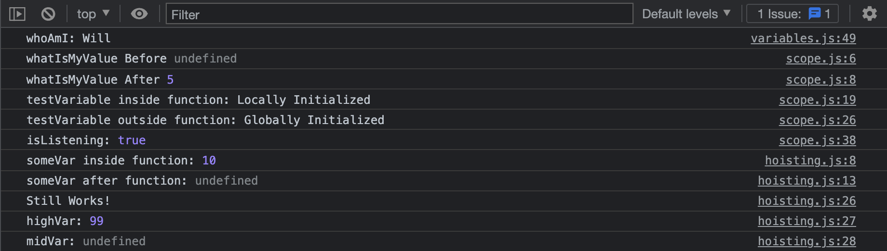

# JavaScript Essential Concepts

[Class 6 Course Content](https://www.youtube.com/playlist?list=PLJhkLjPTf1DLkaryPjdP1RiBakdIen4p6)

## Preparation

### GOALS

By the end of this lesson, you will be able to:

1. **Understand the History of JavaScript**
2. **Confidently Declare Variables**
3. **Use JavaScript Scope Properly**
4. **Apply Hoisting Correctly in a JS Project**

---

**JavaScript Essential Concepts**


---

### CONCEPTS

- **ECMAScript:** _ECMAScript_ is a standard the company _ECMA_ created of which JavaScript is built from and continues to implement and improve upon. ECMA has been shortened to ES as in ES6 or ES7.

- **Variable:** A _variable_ is a container that holds a value or piece of reusable data

- **Scope:** _Scope_ in programming refers to the area or space where a specific element, data, variable, or value is useable. The two types of scope are _Local_ and _Global_.

- **Hoisting:** _Hoisting_ means the movement of a variable or function to the top of its scope during its execution

---

---

## Walkthrough

### STEP 1: DECLARING VARIABLES

**Aim**: Learn the different ways you can declare a variable in JavaScript

| _./variables.js_ |

- [ ] **Variable Initialization**
  - Go over the three ways you can declare a variable in JS

```jsx
// ~ Variable Initialization ~ \\
// This occurs when a variable is declared.
// Here, the variable is assigned a memory or space by the JavaScript engine.
// Because of this, once a variable is declared, it takes an undefined value even before assignment.

var x; // Old way of declaring variables
let y; // ES6+ way of declaring a variable that is mutable and can be changed
const z = 0; // ES6+ way of declaring a variable that is immutable and cannot be changed
```

🔻

- [ ] **Variable Assignment**
  - Practice assigning variables using different declaration values

```jsx
// ~ Variable Assignment ~ \\
// Variable assignment is the most important step when using a variable.
// Here the variable is assigned data which is a value using the assignment operator "=".
// Values in JavaScript take one of the standard JavaScript datatypes which are:
let age = 40; // Number
const name = "Chris"; // String
let developer = true | false; // Boolean
let someLocation = null; // Null
let blue; // undefined
```

🔻

- [ ] **Variable Naming**
  - Walk over some correct examples of declaring variables
  - Go over invalid ways to declare variables

```jsx
// ~ Variable Naming ~ \\
// ✅ VALID
let man;
let woman3;
let blackDog; // This is the best way to name variables with several words (camelCase)

// ❌ INVALID
// let 1girl;   // No numbers at the start of a variable
// let -girl;   // No special characters at the start of a variable
// let ;        // No empty variable names
// const test; // "const" variables must be defined
```

🔻

- [ ] **Assigning Variable Values**
  - Assign three variables in the longhand and shorthand way
  - Assign variables equal to mathematical or string expressions
  - Try assigning the same variable to two different values

```jsx
// ~ Assigning Variable Values ~ \\
let a = 1;
let b = 2;
let c = 3;
// SAME
let d = 10,
  e = 30,
  f = 90;

// Expressions
const taco = "Ta" + "co"; // "Taco"
let answerToTheUniverse = 40 + 1 + 1; // 42

// Double Declarations
let whoAmI = "Bill";
let whoAmI = "Will";
console.log("whoAmI:", whoAmI); // ERROR
```

🔻

**Check**: Ensure you understand JavaScript Variables

- What is the outdated way to declare variables in JS?
- What is the difference between `let` and `const`?
- How can you declare multiple variables at once?
- Can you set a variable equal to an expression?

---

### STEP 2: SCOPE

**Aim**: Learn about JavaScript Scope

| _./scope.js_ |

- [ ] **Walkthrough Demo 1**
  - Declare a variable at the top of the file without assigning a value
  - Create a function that prints the variable, assigns the variable, and prints it again
  - Call the function and check the console

```jsx
// ~ DEMO 1 START ~ \\
let whatIsMyValue; // declare an empty variable

function checkValue() {
  console.log("whatIsMyValue Before", whatIsMyValue); // Check the variables value before
  whatIsMyValue = 5; // initialize the variable
  console.log("whatIsMyValue After", whatIsMyValue); // Check the variables value after
}

checkValue(); // call the checkValue function code
// ~ DEMO 1 END ~ \\
```

🔻

- [ ] **Walkthrough Demo 2**
  - Declare & Initialize a variable
  - Create a function and redeclare and initialize a variable with the same name
  - Print the value of the variable in the function and outside of the function and compare the values

```jsx
// ~ DEMO 2 START ~ \\
let testVariable = "Globally Initialized"; // declare + initialize testVariable GLOBALLY

function callLocalFunction() {
  let testVariable = "Locally Initialized"; // declare + initialize the testVariable LOCALLY in the function
  console.log("testVariable inside function:", testVariable); // Check the value of the testVariable inside the function

  // Note: Creating a new function creates a new local scope called function scope.
}

callLocalFunction(); // call the checkValue function

console.log("testVariable outside function:", testVariable); // Check the value of the testVariable outside the function after the function call
// ~ DEMO 2 END ~ \\
```

🔻

- [ ] **Walkthrough Demo 3**
  - Create a boolean variable
  - Create a function that looks for a conditional to update the value of the boolean variable
  - Call the function
  - Print the variable to the console after calling the function and check the value

```jsx
// ~ DEMO 3 START ~ \\
let isListening = false;

function startConversation(topic) {
  if (topic === "Programming") isListening = true;
}

startConversation("Programming");

console.log("isListening:", isListening); // true
// ~ DEMO 3 END ~ \\
```

🔻

**Check**: Ensure your understanding of JavaScript Scope

- When is it okay to declare a variable and not assign a value?
- Can you declare the same value outside a function and inside using the `let` keyword? How about `const`?

---

### STEP 3: HOISTING

**Aim**: Learn the fundamentals of JavaScript Hoisting

| _./hoisting.js_ |

- [ ] **Walkthrough Demo 1**
  - Declare a variable using `let` without assignment
  - Create a function that redeclares and initializes a variable with the same name and print that to the console
  - Call the function and print the variable value after calling and compare your results

```jsx
// ~ DEMO 1 START ~ \\
// Variable declaration is hoisted. Assignment doesn't happen until later.
let someVar;

function checkIfHoisted() {
  let someVar = 10;
  console.log("someVar inside function:", someVar); // 10
}

checkIfHoisted();

console.log("someVar after function:", someVar); // undefined
// ~ DEMO 1 END ~ \\
```

🔻

- [ ] **Walkthrough Demo 2**
  - Declare three variables in different locations
  - Call a function you have not declared
  - Create the function and print the values to all three variables inside to compare different hoisting mechanics in JS

```jsx
// ~ DEMO 2 START ~ \\
let highVar = 99;

let midVar;

fakeoutFunc();

midVar = 44;

function fakeoutFunc() {
  console.log("Still Works!");
  console.log("highVar:", highVar);
  console.log("midVar:", midVar);
  console.log("lowVar:", lowVar);
}

let lowVar = 1;
// ~ DEMO 2 END ~ \\
```

🔻

**Check**: Ensure your understanding of Hoisting in JavaScript

- Does every language have hoisting built-in?
- Can you call a function before declaring it?

---

---

## Review

### ACCOMPLISHMENTS

Congratulations yet again! 🎊🎉

Feel proud that **you learned something new and valuable today**.

Learning to code is a journey, and you are taking the necessary steps to improve your skills and opportunities for the future.

_Good on you!_

Specifically, we learned how to:

- Use the correct variable for the right job
- Understand the way _scope_ works inside of JavaScript
- Practice hoisting in our applications

---

### RESOURCES

[Clean Code JavaScript _(Repository)_](https://github.com/ryanmcdermott/clean-code-javascript)

[What is Scope and Scope Chain in JavaScript? _(Article)_](https://dev.to/sumusiriwardana/what-is-scope-and-scope-chain-in-javascript-52j5)

---

---
