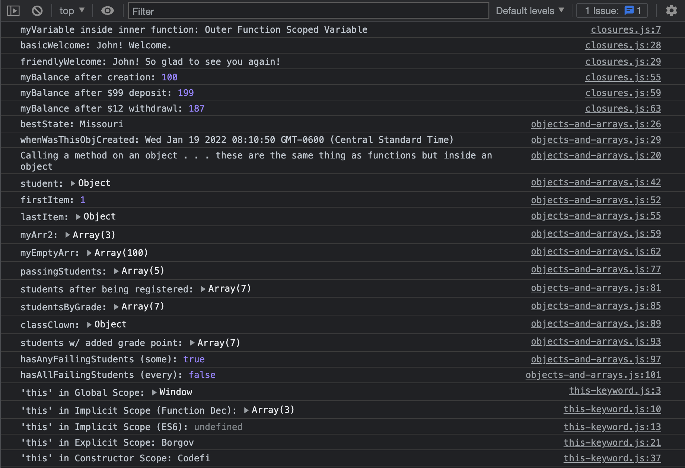

# JavaScript Intermediate Concepts

[Class 7 Course Content](https://www.youtube.com/playlist?list=PLJhkLjPTf1DL2RyG_D3ufpyHbBx9QF_Di)

## Preparation

### GOALS

By the end of this lesson, you will be able to:

1. **Comprehend Closures**
2. **Master JS Objects & Arrays & Use Common Object/Array Methods**
3. **Tolerate the "this" Keyword**

---

**JavaScript Intermediate Concepts**


---

### CONCEPTS

- **Closures:** A _Closure_ is a reference to the local scope when code has been executed out of the surrounding state. A closure gives you access to an outer function’s scope from an inner function. Closures are handy in cases where you want to use data encapsulation, create higher-order functions or built-in JavaScript methods like `.map()` or `.filter()`.

- **this:** The _this_ keyword in JavaScript is notorious for being difficult to explain. It ("this") refers to different things depending on its execution context.

---

---

## Walkthrough

### STEP 1: CLOSURES

**Aim**: Master the fundamentals of JavaScript Closures

| _./closures.js_ |

- [ ] **Brief Introduction on Demo 1**
  - Declare a variable inside a function
  - Create a function inside that function that prints the variable to the console
  - In the first function, call the inner function
  - In the global scope, call the outer function

```jsx
function outer() {
  let myVariable = "Outer Function Scoped Variable";

  function inner() {
    console.log("myVariable inside inner function:", myVariable);
  }

  inner();
}

outer(); // Prints: myVariable inside inner function: Outer Function Scoped Variable
```

🔻

- [ ] **Walkthrough Full Code for Demo 1**
  - Save the output of the outer function, which calls the inner function in a variable
  - Call the variable and check the console

```jsx
// ~ DEMO 1 START ~ \\
function outer() {
  let myVariable = "Outer Function Scoped Variable";

  function inner() {
    console.log("myVariable inside inner function:", myVariable);
  }

  return inner;
}

const outerFunctionCall = outer();

outerFunctionCall(); // Prints: myVariable inside inner function: Outer Function Scoped Variable
// ~ DEMO 1 END ~ \\
```

🔻

- [ ] **Walkthrough Demo 2**
  - Create a `greeting` function that returns another function which takes in a second parameter
  - Create a variable that calls the greeting function passing in a generic greeting
  - Call the variable passing in the name (used for the second parameter callback function)
  - Test again

```jsx
// ~ DEMO 2 START ~ \\
function greeting(greeting) {
  return function(name) {
    return `${name}! ${greeting}`;
  };
}

const basicWelcome = greeting("Welcome.");
const friendlyWelcome = greeting("So glad to see you again!");

console.log("basicWelcome:", basicWelcome("John"));
console.log("friendlyWelcome:", friendlyWelcome("John"));
// ~ DEMO 2 END ~ \\
```

🔻

- [ ] **Walkthrough Demo 3**
  - Create a `createBankAccount` function that takes in an initial balance and declares it in the main function scope
  - Return an object of methods that use this variable
  - Create a variable with an initial value
  - Use that variable and call methods on it to add functionality
  - Print the results

```jsx
// ~ DEMO 3 START ~ \\
const createBankAccount = initialBalance => {
  let userBalance = initialBalance;

  return {
    getBalance: function() {
      return userBalance;
    },
    deposit: function(amount) {
      userBalance += amount;
      return userBalance;
    },
    withdrawl: function(amount) {
      userBalance -= amount;
      return userBalance;
    }
  };
};

const myAccount = createBankAccount(100);
let myBalance;

myBalance = myAccount.getBalance(); // 100
console.log("myBalance after creation:", myBalance);

myAccount.deposit(99);
myBalance = myAccount.getBalance(); // 100
console.log("myBalance after $99 deposit:", myBalance);

myAccount.withdrawl(12);
myBalance = myAccount.getBalance(); // 100
console.log("myBalance after $12 withdrawl:", myBalance);
// ~ DEMO 3 END ~ \\
```

🔻

**Check**: Ensure your understanding of JS Closures

- What is a closure, and why would we want to use them?

---

### STEP 2: OBJECTS

**Aim**: Master the fundamentals of JavaScript Objects

| _./objects-and-arrays.js_ |

- [ ] **Walkthrough Creating an Object Example**

```jsx
// ~ OBJECTS ~ \\
// Objects stores data grouped together using key/value pairs

// Object Example
const myObj = {
  key: "Value",
  nestedInfo: {
    nestedKey: "Nested Value",
    age: 42,
    location: {
      state: {
        name: "Missouri",
        initials: "MO"
      }
    }
  },
  createdAt: new Date(),
  someMethod: function(text = "Hello") {
    console.log(text);
  }
};
```

🔻

- [ ] **Walkthrough How to Use an Object**
  - Show how to access a property on an object
  - Show how to call a method on an object

```jsx
// Object Property Usage
const bestState = myObj.nestedInfo.location.state.name;
console.log("bestState:", bestState);

const whenWasThisObjCreated = myObj["createdAt"];
console.log("whenWasThisObjCreated:", whenWasThisObjCreated);

// Object Method Usage
myObj.someMethod(
  "Calling a method on an object . . . these are the same thing as functions but inside an object"
);
```

🔻

- [ ] **Walkthrough Object Constructors**

```jsx
// Object Constructors
const student = new Object();

student.learning = "JavaScript";
student.name = "Missy";

console.log("student:", student);
```

🔻

**Check**: Ensure your understanding of JS Objects

- Can an object store multiple different data-types?
- What are the two ways you can select a property on an object?

---

### STEP 3: ARRAYS

**Aim**: Master the fundamentals of JavaScript Arrays

| _./objects-and-arrays.js_ |

- [ ] **Walkthrough Creating an Array Example**

```jsx
// ~ ARRAYS ~ \\
// Arrays stores information in a list-like format

// Array Example
const myArr = [1, "Test", false, { name: "Chris", age: 33 }];
```

🔻

- [ ] **Walkthrough Accessing Arrays**

```jsx
// Accessing Arrays
let firstItem = myArr[0];
console.log("firstItem:", firstItem);

let lastItem = myArr[myArr.length - 1];
console.log("lastItem:", lastItem);
```

🔻

- [ ] **Walkthrough Using the Array Constructor**

```jsx
// Array Constructor
const myArr2 = new Array("item 1", "item 2", "item 3");
console.log("myArr2:", myArr2);

const myEmptyArr = new Array(100);
console.log("myEmptyArr:", myEmptyArr);
```

🔻

- [ ] **Walkthrough Common Array Methods**
  - Filter
  - Map
  - Sort
  - Find
  - ForEach
  - Some
  - Every

```jsx
// ~ Common Array Methods ~ \\
const students = [
  { name: "Medina", grade: 88 },
  { name: "Blake", grade: 72 },
  { name: "Roscoe", grade: 58 },
  { name: "Stephanie", grade: 99 },
  { name: "Edith", grade: 93 },
  { name: "Janey", grade: 34 },
  { name: "Ivan", grade: 89 }
];

// filter
const passingStudents = students.filter(student => student.grade > 58);
console.log("passingStudents:", passingStudents);

// map
students.map(student => (student.isRegistered = true));
console.log("students after being registered:", students);

// sort
const studentsByGrade = students.sort((a, b) => b.grade - a.grade);
console.log("studentsByGrade:", studentsByGrade);

// find
const classClown = students.find(student => student.name === "Roscoe");
console.log("classClown:", classClown);

// forEach
students.forEach(student => student.grade++);
console.log("students w/ added grade point:", students);

// some
const hasAnyFailingStudents = students.some(student => student.grade < 59);
console.log("hasAnyFailingStudents (some):", hasAnyFailingStudents);

// every
const hasAllFailingStudents = students.every(student => student.grade < 59);
console.log("hasAllFailingStudents (every):", hasAllFailingStudents);
```

🔻

**Check**: Ensure your understanding of JavaScript Arrays

- How do you access the first item in an array? How about the last?
- How would you create an array with nine empty spaces?
- What array method would you use to check if at least one element in an array meets a particular condition?

---

### STEP 4: THIS KEYWORD

**Aim**: Master the fundamentals of the JavaScript "_this_" keyword

| _./this-keyword.js_ |

- [ ] **Walkthrough Global Binding**

```jsx
// ~ Global Binding (Default) ~ //
console.log("'this' in Global Scope:", this);
```

🔻

- [ ] **Walkthrough Implicit Binding**

```jsx
// ~ Implicit Binding ~ //
const classroom = {
  name: "High Five",
  students: ["Valory", "Zane", "Ipsum"],
  printStudents: function() {
    console.log("'this' in Implicit Scope (Function Dec):", this.students);
  },
  printStudentsES6: () =>
    console.log("'this' in Implicit Scope (ES6):", this.students) // 'this' refers to the global window object here
};

classroom.printStudents();
classroom.printStudentsES6();
```

🔻

- [ ] **Walkthrough Explicit Binding**

```jsx
// ~ Explicit Binding ~ //
const getName = function() {
  console.log("'this' in Explicit Scope:", this.name);
};

const player = {
  name: "Borgov",
  isHappy: false
};

getName.call(player);
```

🔻

- [ ] **Walkthrough Constructor Binding**

```jsx
// ~ Constructor Binding ~ //
function Company(name) {
  this.name = name;
}

const codefi = new Company("Codefi");
console.log("'this' in Constructor Scope:", codefi.name);
```

🔻

**Check**: Ensure your understanding of the JavaScript "_this_" keyword

- What does the 'this' keyword point to in the global scope?
- When using implicit binding, what style of function do you want to use to ensure 'this' refers to the object's instance rather than the global window object?

---

---

## Review

### ACCOMPLISHMENTS

Congratulations yet again! 🎊🎉

Feel proud that **you learned something new and valuable today**.

Learning to code is a journey, and you are taking the necessary steps to improve your skills and opportunities for the future.

_Good on you!_

Specifically, we learned how to:

- Utilize the power of JavaScript Closures
- Understand and apply objects and arrays in JavaScript
- Demystify and harness the power of the "_this_" keyword

---

### RESOURCES

[Array Method Explorer _(Tool)_](https://codepen.io/sdras/pen/gogVRX)

[8 Must Know JavaScript Array Methods _(Video)_](https://www.youtube.com/watch?v=R8rmfD9Y5-c&ab_channel=WebDevSimplified)

[JavaScript Arrays: Explain Like I'm Five _(Article)_](https://dev.to/sumusiriwardana/javascript-arrays-explain-like-im-five-33ak)

---

---
