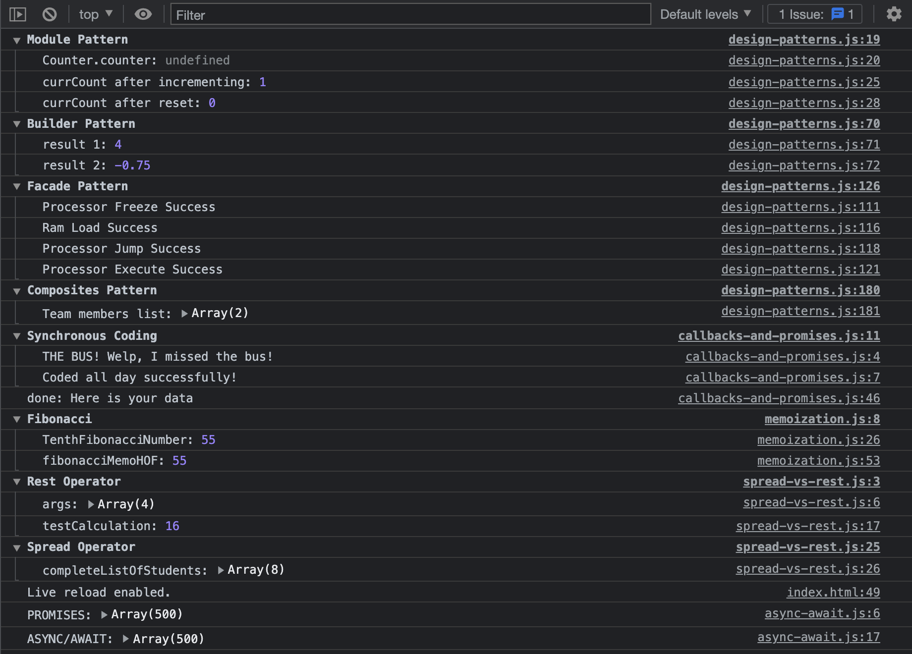

# JavaScript Advanced Concepts

[Class 8 Course Content]()

## Preparation

### GOALS

By the end of this lesson, you will be able to:

1. **Code Using Common Design Patterns**
2. **Practice Callbacks and Promises**
3. **Create Asynchronous Code Using Async / Await**
4. **Grasp Memoization**
5. **Distinguish and Implement the Spread & Rest Operators**

---

**JavaScript Advanced Concepts**


---

### CONCEPTS

- **Design Pattern:** A _design pattern_ is a blueprint and a set of best practices on how to solve a problem and structure your application in a software engineering project.

The three types of design patterns are **creation patterns** (ways to create objects), **structural patterns** (ways to manage relationships between objects), and **behavioral patterns** (interactions between objects).

- **Asynchronous Code:** _Asynchronous code_ is a programming model where operations occur in a non-sequential fashion.

- **Memoization:** _Memoization_ is an optimization technique used primarily to speed up computer programs by storing the results of expensive function calls and returning the cached result when the same inputs are given.

- **Spread Operator:** The _spread operator_ is a way to expand iterates (arrays, objects, and strings) into a single argument _spread_ across one by one.

- **Rest Operator:** The _rest operator_ is a way to collect all remaining elements in an array of arguments on a function call.

---

---

## Walkthrough

### STEP 1: DESIGN PATTERNS

"One of the most important aspects of writing maintainable code is being able to notice the recurring themes in that code and optimize them. This is an area where knowledge of design patterns can prove invaluable." - Addy Osmani

**Aim**: Master the fundamentals of JavaScript Design Patterns

| _./design-patterns.js_ |

- [ ] **Walkthrough Module Design Pattern Demo**
  - This is a _creational_ pattern
  - This pattern is where all the module code exists inside a closure
  - It is often expressed as an IIFE or Immediately-Invoked-Function-Expression
  - They are helpful in systems that exceed single function use, to keep your global namespace clean, and to ensure cleaner architecture for importing and exporting functions

```jsx
// Module Pattern Demo Start \\
const Counter = (function() {
  let counter = 0;

  return {
    incrementCounter: function() {
      return ++counter;
    },

    resetCounter: function() {
      return (counter = 0);
    }
  };
})();

// Usage:
console.log("Counter.counter:", Counter.counter); // Notice how we don't have direct access to the counter variable

let currCount;

currCount = Counter.incrementCounter();
console.log("currCount after incrementing:", currCount);

currCount = Counter.resetCounter();
console.log("currCount after reset:", currCount);
// Module Pattern Demo End \\
```

🔻

- [ ] **OPTIONAL: Walkthrough Builder Design Pattern Demo**
  - This is a _creational_ pattern
  - This pattern lets us construct objects without having to code the object explicitly
  - To make this pattern work, specify a type and content of an object that JavaScript recognizes
  - The purpose is to separate the construction of the object from it's representation to make creating common objects easier and more efficient

```jsx
// Builder Pattern Demo Start \\
class Calculator {
  constructor(props) {
    this.result = 0;
  }

  add(num) {
    this.result += num;
    return this;
  }

  subtract(num) {
    this.result -= num;
    return this;
  }

  multiply(num) {
    this.result *= num;
    return this;
  }

  divide(num) {
    this.result /= num;
    return this;
  }

  compute() {
    return this.result;
  }
}

// Usage:
let calculator = new Calculator();
let calculator2 = new Calculator();

let expression1 = calculator
  .add(5)
  .subtract(1)
  .multiply(2)
  .divide(2);
let expression2 = calculator2
  .add(1)
  .subtract(4)
  .multiply(2)
  .divide(8);

console.groupCollapsed("Builder Pattern");
console.log("result 1:", expression1.result);
console.log("result 2:", expression2.result);
console.groupEnd();
// Builder Pattern Demo End \\
```

🔻

- [ ] **OPTIONAL: Walkthrough Facade Design Pattern Demo**
  - This is a _structural_ pattern
  - This pattern comes to play when an internal subroutine is hidden and invoked by another function without being exposed (as in a facade)
  - The purpose is to conceal or protect a larger piece of logic under a single function call that never exposes its internal workings to other developers

```jsx
// Facade Pattern Demo Start \\
class CPU {
  freeze() {
    // Code here
  }
  jump(position) {
    // Code here
  }
  execute() {
    // Code here
  }
}

class Memory {
  load(pos, data) {
    // Code Here
  }
}

class HardDrive {
  read(lba, size) {
    // Code Here
  }
}

class ComputerFacade {
  constructor() {
    this.processor = new CPU();
    this.ram = new Memory();
    this.hd = new HardDrive();
  }

  start() {
    this.processor.freeze();
    console.log("Processor Freeze Success");
    this.ram.load(
      this.BOOT_ADDRESS,
      this.hd.read(this.BOOT_SECTOR, this.SECTOR_SIZE)
    );
    console.log("Ram Load Success");
    this.processor.jump(this.BOOT_ADDRESS);
    console.log("Processor Jump Success");
    // . . .
    this.processor.execute();
    console.log("Processor Execute Success");
  }
}

// Usage:
console.groupCollapsed("Facade Pattern");
let computer = new ComputerFacade();
computer.start();
console.groupEnd();
// Facade Pattern Demo End \\
```

🔻

- [ ] **Walkthrough Composite Design Pattern Demo**
  - This is a _structrual_ pattern
  - This pattern is where objects are composed of multiple parts to create a single entity that, in turn, becomes the access point for all the parts

```jsx
// Composites Pattern Demo Start \\
// Component Class
class Employee {
  constructor(name, position) {
    this.name = name;
    this.position = position;
  }
}

// Leaf Subclass
class SoftwareDeveloper extends Employee {
  constructor(name, position) {
    super(name, position);
  }
}
// Leaf Subclass
class FreelanceDesigner extends Employee {
  constructor(name, position) {
    super(name, position);
  }
}

// Composite Subclass
class DevTeamLead extends Employee {
  constructor(name, position) {
    super(name, position);
    this.teamMembers = [];
  }

  addMember(employee) {
    this.teamMembers.push(employee);
  }

  viewTeam() {
    let employeeNames = this.teamMembers.map(member => member.name);
    return employeeNames;
  }
  // . . .
}

// Usage:
const seniorDev = new SoftwareDeveloper("Rachel", "Senior Developer");
const companyDesigner = new FreelanceDesigner("Joey", "Web Designer");
const teamLead = new DevTeamLead("Regina", "Dev Team Lead");

teamLead.addMember(seniorDev);
teamLead.addMember(companyDesigner);

console.groupCollapsed("Composites Pattern");
console.log("Team members list:", teamLead.viewTeam());
console.groupEnd();
// Composites Pattern Demo End \\
```

🔻

- [ ] **OPTIONAL: Walkthrough Observer Design Pattern Demo**
  - This is a _behavioral_ pattern
  - This pattern entails creating a single object that references a collection of objects and emits notifications when a state change occurs
  - This is good for decoupling objects, promotes smaller, more reusable components, and helps developers pinpoint dependencies and form a better mental model of how all components work together
  - Later on in the Angular portion, we will often make use of the `.subscribe()` method, which implements the _observer_ pattern

```html
<textarea
  id="blogPost"
  placeholder="Enter your blog post..."
  class="blogPost"
></textarea>
```

```jsx
// Observer Pattern Demo Start \\
class EventObserver {
  constructor() {
    this.observers = [];
  }

  subscribe(fn) {
    this.observers.push(fn);
  }

  unsubscribe(fn) {
    this.observers = this.observers.filter(sub => sub !== fn);
  }

  broadcast(data) {
    this.observers.forEach(sub => sub(data));
  }
}

// Usage:
const getWordCount = text => (text ? text.trim().split(/\s+/).length : 0);

const wordCountElement = document.createElement("p");

wordCountElement.className = "wordCount";
wordCountElement.innerHTML =
  'Word Count: <strong id="blogWordCount">0</strong>';
document.body.appendChild(wordCountElement);

const blogObserver = new EventObserver();

blogObserver.subscribe(text => {
  const blogCount = document.getElementById("blogWordCount");

  blogCount.textContent = getWordCount(text);
});

const blogPost = document.getElementById("blogPost");

blogPost.addEventListener("keyup", () =>
  blogObserver.broadcast(blogPost.value)
);
// Observer Pattern Demo End \\
```

🔻

**Check**: Ensure your understanding of JavaScript Design Patterns

- What are the three types of design patterns?
- When would you use the _Facade_ pattern?
- What pattern is often expressed as an IIFE? What does IIFE stand for?
- What is the _Observer_ Design Pattern?

---

### STEP 2: CALLBACKS, PROMISES, ASYNC

**Aim**: Master the fundamentals of JavaScript Callbacks & Promises

| _./callbacks-and-promises.js_ |

- [ ] **Walkthrough Synchronous Coding**

```jsx
// ~~~~~ SYNCHRONOUS CODING ~~~~~ \\
function goToSchool() {
  console.log("THE BUS! Welp, I missed the bus!");
}
function code() {
  console.log("Coded all day successfully!");
}

// Usage:
console.groupCollapsed("Synchronous Coding");
goToSchool();
code();
console.groupEnd();
```

🔻

- [ ] **Walkthrough Using Callbacks**

```jsx
// ~~~~~ CALLBACKS ~~~~~ \\
function growCorn() {
  setTimeout(() => {
    console.log("Corn Success");
  }, 3000);
}
function PickApple() {
  console.log("Apple Success");
}

// Usage:
growCorn();
PickApple();
```

🔻

- [ ] **Walkthrough Using Promises**

```jsx
// ~~~~~ PROMISES ~~~~~ \\
const someAPIRequest = {
  success: Math.random() < 0.5,
  data: "Here is your data"
};
const getDetails = new Promise((resolve, reject) => {
  if (someAPIRequest.success) {
    resolve(someAPIRequest.data);
  } else {
    reject(new Error("API Request Failed. Try again."));
  }
});

// Usage:
getDetails
  .then(done => {
    console.log("done:", done);
  })
  .catch(err => {
    console.log("err:", err);
  });
```

🔻

**Check**: Ensure your understanding of JavaScript Callbacks & Promises

- Is there a difference between a callback and a promise?
- What are some examples of built-in JavaScript callbacks?
- How do you add error handling to a promise?

---

### STEP 3: ASYNC / AWAIT

**Aim**: Master the fundamentals of JavaScript Async / Await

- ASYNC FUNCTIONS ALWAYS RETURN A PROMISE

| _./async-await.js_ |

- [ ] **Walkthrough Making an API Request Using Promises**

```jsx
// ~~~~~ OLD WAY (PROMISES) ~~~~~ \\
function getAllCommentsUsingPromises() {
  const data = fetch("https://jsonplaceholder.typicode.com/comments")
    .then(response => response.json())
    .then(json => console.log("PROMISES:", json))
    .catch(err => console.log("err:", err));
}

getAllCommentsUsingPromises();
```

🔻

- [ ] **Walkthrough Making an API Request Using Promises**

```jsx
// ~~~~~ NEW WAY (ASYNC/AWAIT) ~~~~~ \\
async function getAllCommentsUsingAsyncAwait() {
  try {
    const data = await fetch("https://jsonplaceholder.typicode.com/comments");
    const res = await data.json();
    console.log("ASYNC/AWAIT:", res);
  } catch (err) {
    console.log("err:", err);
  }
}

getAllCommentsUsingAsyncAwait();
```

🔻

**Check**: Ensure your understanding of JavaScript Async & Await

- How do you perform error handling while using async / await?
- What does an async function return?

---

### STEP 4: MEMOIZATION

**Aim**: Master the fundamentals of JavaScript Memoization

| _./memoization.js_ |

- [ ] **Walkthrough Fibonnaci Basics**

```jsx
function fibonacci(n) {
  // Base Case
  if (n <= 2) return 1;

  //   Recursive Function call
  return fibonacci(n - 1) + fibonacci(n - 2);
}
```

🔻

- [ ] **Walkthrough Fibonacci Memoized Demo**

```jsx
// Memoized
function memoizedFibonacci(n, memo) {
  // Memoization Initialization
  memo = memo || {};

  // Memoization Call
  if (memo[n]) return memo[n];

  // Base Case
  if (n <= 2) return 1;

  //   Recursive Function call
  return (memo[n] =
    memoizedFibonacci(n - 1, memo) + memoizedFibonacci(n - 2, memo));
}

const TenthFibonacciNumber = memoizedFibonacci(10);
console.log("TenthFibonacciNumber:", TenthFibonacciNumber);
```

🔻

- [ ] **Walkthrough Fibonacci HOF Demo**

```jsx
// ~~~~~~ MEMOIZED HOF ~~~~~~ \\
function fibonacciRecursion(n) {
  // Base Case
  if (n <= 2) return 1;

  //   Recursive Function call
  return fibonacciRecursion(n - 1) + fibonacciRecursion(n - 2);
}

function memoizer(fun) {
  let cache = {};

  return function(n) {
    if (cache[n] != undefined) {
      return cache[n];
    } else {
      let result = fun(n);
      cache[n] = result;

      return result;
    }
  };
}

const fibonacciMemoHOF = memoizer(fibonacciRecursion);
console.log("fibonacciMemoHOF:", fibonacciMemoHOF(10));
console.groupEnd();
```

🔻

**Check**: Ensure your understanding of JavaScript Memoization

- What is memoization in your own words?
- Should you memoize every function?

---

### STEP 5: SPREAD VS. REST

**Aim**: Comprehend the differences of JavaScript Spread vs. Rest

| _./spread-vs-rest.js_ |

- [ ] **Walkthrough Using the REST Operator**

```jsx
// ~~~~~~~ REST OPERATOR ~~~~~~~ \\
console.groupCollapsed("Rest Operator");

function sumOf(...args) {
  console.log("args:", args);

  let sum = 0;

  args.forEach(arg => (sum += arg));

  return sum;
}

const testCalculation = sumOf(1, 2, 5, 8);

console.log("testCalculation:", testCalculation);
console.groupEnd();
```

🔻

- [ ] **Walkthrough Using the SPREAD Operator**

```jsx
// ~~~~~~~ SPREAD OPERATOR ~~~~~~~ \\
const ninthGraders = ["Jennifer", "Berry", "Ashley", "Bernard"];
const tenthGraders = ["Jason", "Amy", "Samuel", "Cook"];
const completeListOfStudents = [...ninthGraders, ...tenthGraders];

console.groupCollapsed("Spread Operator");
console.log("completeListOfStudents:", completeListOfStudents);
console.groupEnd();
```

🔻

**Check**: Ensure your understanding of JavaScript Spread Operator, and its difference to the JavaScript Rest Operator

- What is the difference between the _spread_ and _rest_ operators?
- Can you think of a few real-world use cases for each?

---

---

## Review

### ACCOMPLISHMENTS

Congratulations yet again! 🎊🎉

Feel proud that **you learned something new and valuable today**.

Learning to code is a journey, and you are taking the necessary steps to improve your skills and opportunities for the future.

_Good on you!_

Specifically, we learned how to:

- Structure our JavaScript applications using different design patterns
- Create callbacks and promises in JavaScript
- Use `async` and `await` keywords to code asynchronously
- Comprehend _memoization_ in programming
- Discern when to use the _spread operator_ and the _rest operator_

---

### RESOURCES

[What the Heck is the Event Loop Anyway? _(Video)_](https://www.youtube.com/watch?v=8aGhZQkoFbQ&ab_channel=JSConf)

[The Async Await Episode I Promised _(Video)_](https://www.youtube.com/watch?v=vn3tm0quoqE)

[Design Patterns Playlist _(Video)_](https://www.youtube.com/playlist?list=PLZlA0Gpn_vH_CthENcPCM0Dww6a5XYC7f)

[Modern JS Cheatsheet _(Article)_](https://mbeaudru.github.io/modern-js-cheatsheet/)

---

---
