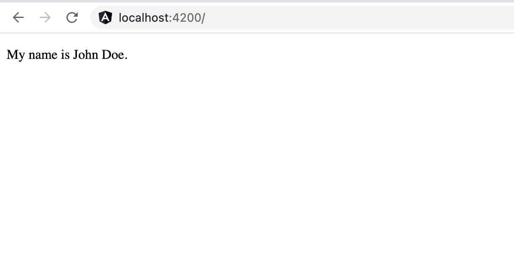
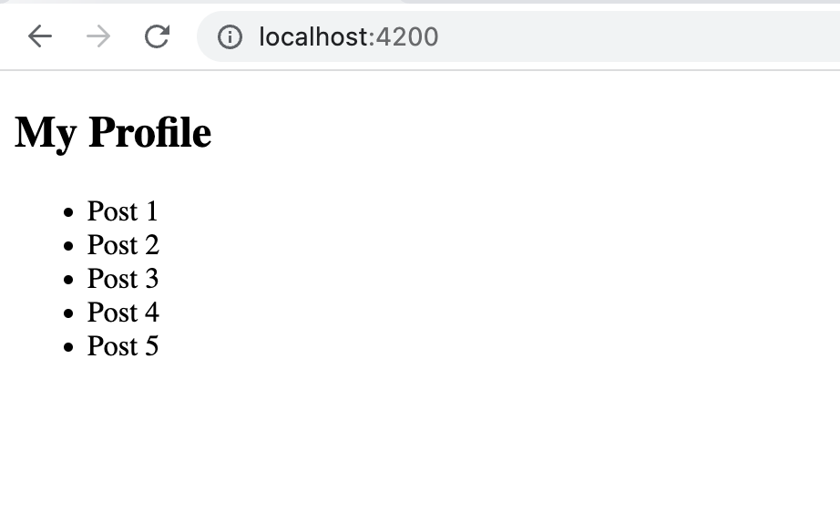
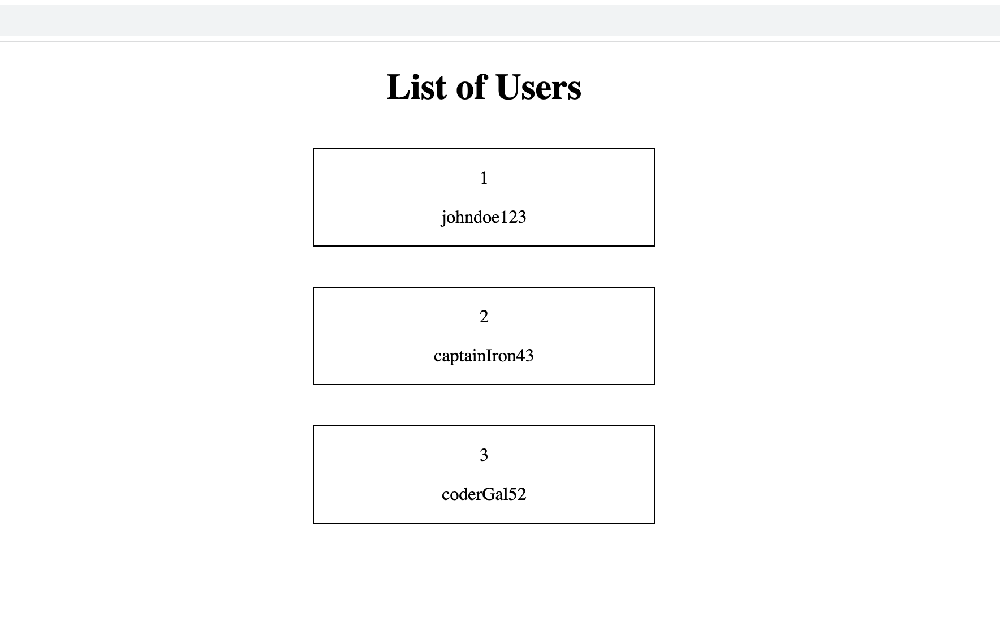
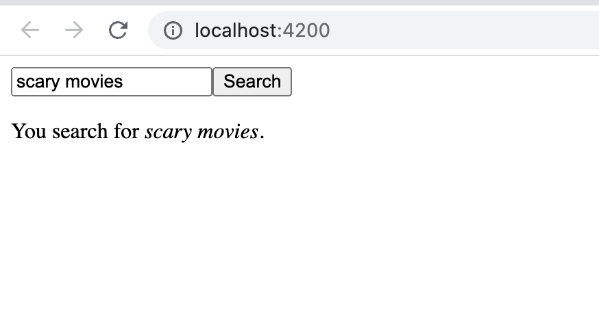

# Components & Databinding Deep Dive Exercises

**Use Git or GitHub Desktop to push each exercise to GitHub**

_NOTE_: Make projects all non-strict mode

---

---

## Exercise 1: Allow a child component to receive values from the parent component using the input decorator

1. Create a new angular project called `angular-basic-custom-property-exercise`
2. Generate a component called user, nest user in the app component
3. In `app.component.ts`, create a instance property called `name` of type string and set it to your name.
4. In `user.component.ts`, create a instance property called `myName` of type string and set it initially to an empty string. Then, configure this property by the `@Input()` Decorator

- Create a paragraph element in user.component.html. Set its content to `My name is` follow by the value of `myName`

5. In `app.component.html`, pass down the name property to the user component
6. run `ng serve`, and you should see your name on the webpage

---

## Exercise 2: Passing down information two levels deep using the input decorator

1. Create a new angular project called `angular-nested-components-input-exercise`
2. Generate two components called `my-profile` and `posts`. In `my-profile`, create an h1 element with the content 'My Profile'
3. `my-profile` should be nested in the app component, and `posts` should be nested in the `my-profile` component
4. In the `app.component.ts` file, create a instance property called `myPosts` that is of type array of strings and set it to an array of pre-filled strings
5. Pass down `myPosts` to the `my-profile` component, and make `my-profile` pass that down to the posts component
6. In `posts.component.html`, use `ngFor` to output the array of strings
7. run `ng serve`, and you should see a list of strings you added to the `myPosts` array.

---

## Exercise 3: Use ngFor and the input decorator to allow the parent component to pass down information to the child component

1. Create a new angular project called `angular-ngFor-input-decorator-exercise`
2. Generate a component called user and nest it in the app component. In app.component.html, create a h1 element with conent 'List of Users'
3. In `app.component.ts`, create a instance property called `users` that is an array of type object. The object must contain properties username of type string and id of type number. Then, fill the array with these objects
4. Use `ngFor` to iterate through the users. While iterating, use the user component to render each user's information.
5. Give the property that is configured by the input decorator an alias of `inputUser`
6. Style the elements. Center the `h1` element. Each user information has to be centered as well as include a black border with margin spacing. You can use bootstrap or inline styling to accomplish this.
7. run `ng serve`, and you should see a list of users.

---

## Exercise 4: Use a custom event to pass information to the parent component

1. Create a new angular project called `angular-basic-custom-event-exercise`
2. Generate a component called navbar and nest it in the app component
3. In `navbar.component.html` file, create an input element and incorporate two-way data binding to store the value in a instance property called `mySearch`
4. In `navbar.component.ts`, use an event emitter and an output decorator to emit the instance property `mySearch`
5. Configure `app.component.html`, to store that information sent by navbar in a instance property called `searchResult`
6. Use string interpolation to output `searchResult`

---

## Exercise 5: Pass up information two levels

1. Create a new angular project called `angular-two-levels-custom-events`
2. Generate components called `bookshelf` and `bookshelf-list`
3. The bookshelf component should be nested in the app component, and bookshelf-details should be nested in the bookshelf component
4. In `bookshelf-list.component.ts`, create a instance property called `books`, an array of objects containing properties such as title and author. Fill in the data for multiple objects
5. In `bookshelf-list.component.ts`, use `ngFor` to output the elements of the instance property books
6. Whenever you click on a "book", use event binding to execute a method. That method should emit the object the user click
7. Configure the bookshelf component to receive the object the user clicks and use a custom event to pass the information to the app component.
8. The app component should store this object in a property and use string interpolation to output the values of its properties

---

## Exercise 6: Using the input and output decorators for cross-component communication

1. Create a new angular project called `angular-output-input-exercise`
2. Generate components called navbar and search-page
3. Nest both navbar and search-page in the app component
4. In `navbar.component.html`, create an input element and button.
5. When the user enters a search, he/she should be able to click a button to see the search displayed, `You searched for ...`. Allow the search-page component to render this.
