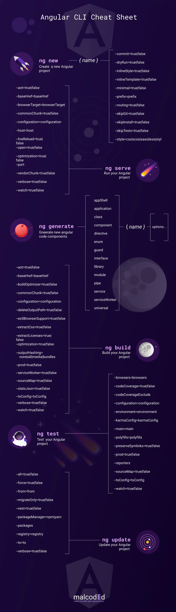

# Class 28 - Angular as a Platform & Closer Look at the CLI && Course Roundup

[Class 28 Course Content](https://pro.academind.com/courses/765847/lectures/13906852)

## Lesson Outline

Today we will learn more about:

1. **The Angular CLI**
2. **Configuration files**
3. **Testing files**
4. **Typescript files**
5. **CLI Commands**
6. **Schematics**
7. **Differential Loading**
8. **What to do now**

---

---

## Lesson Notes

- **Angular CLI:** The _Angular Command Line Interface (CLI)_ is a terminal tool where one types in commands provided by Angular to initialize, develop, scaffold, and maintain.

- **Typescript:** _Typescript_ is a super-set or variant of Javascript that provides static typing of variables, functions, and classes that increases readability, early error detection, and team consistency.

- **JSON:** _Javascript Object Notation (JSON)_ is a lightweight format for storing and transporting data that is human-readable and machine-friendly.

- **Differential Loading:** _Differential Loading_ is a mechanism Angular uses behind-the-scenes to provide or take away features depending on if the browser is modern or not so every user gets the bundle they need and can use effectively.

- **CLI Builders:** _CLI Builders_ are functions that implement the logic and behavior for a task that can replace a command. Using the CLI Builders is a way to prepare your code for different environment. Some examples include "linting", "testing", and "deploying".

---

---

## Angular as a Platform - Walkthrough Steps

### STEP 1: Angular CLI Commands

_Terminal_:

- Type `ng new --help` to see all commands when creating a new Angular project.

- _NOTE_: You can use the `--help` flag on most Angular commands to see the options for that particular method. EG: `ng serve --help`.

- _NOTE_: Many of the options you can choose as flags can be configured on an existing project inside the _angular.json_ file.

- Create a new project called "angular-config" and open it in VSCode.

```zsh
ng new --help
# . . .
ng new angular-config
# . . .
cd angular-config
# . . .
code .
```

---

### STEP 2: Walking Through Various Config Files

_.editorconfig_:

- This file configures the code styling and formatting of the project.

_.gitignore_:

- This file tells the git repository inside this folder to ignore anything in this file. All the files and folders described will not be tracked and not be sent to GitHub.

_browserslistrc_:

- This file tells the Angular CLI what browsers to support.

_karma.conf.js_:

- This file configures the Unit Tests for the project.

_package.json_:

- This file manages all packages (and their versions) the project needs to run successfully. It also contains scripts that can be executed in the command line.

- _Dependencies_ are third-party packages installed that must be shipped to production for the application to function properly.

- _DevDependencies_ are third-party packages installed that will not be shipped to production servers as they are tools used during the development process. You install devDependencies by running `npm i --save-dev MY_PACKAGE`.

_tsconfig.json_:

- This file configures the typescript compiler to watch for certain behaviors while ignoring others.

### STEP 3: Walking Through the Angular.JSON file

_angular.json_:

- This file is generated every time a new Angular project is created using the CLI.

- This file is used by the CLI behind-the-scenes to configure commands based on project needs.

- The _\$schema_ is information the Angular team provides as defaults for general project layout and configuration.

- The _newProjectRoot_ is where projects are added if managing multiple applications in one file is beneficial.

- In the _projects_ object, there lies the:
  - _projectType_ which signifies the type of application.
  - _schematics_ which are used to customize the `ng generate` sub-commands.
  - _root_ which tells Angular CLI where the root folder of the application is stored.
  - _sourceRoot_ which is where the source files are located.
  - _prefix_ which is where to configure the prefix to every component.
  - _architect_ which has many different commands relating to building, serving, and testing the application.

---

### STEP 4: All About Schematics

- _Schematics_ are blueprints Angular commands can use to do a whole bunch of stuff at once, reliably.

- Examples of Schematics include:
  - `ng generate`... the command to create a component, directive, or service the same way every time.
  - `ng add`... the command to add libraries and functionality to the project.
  - `ng update`... the command to update all packages the project requires.

---

---

## Course Wrap up

- Congratulations!!! You made it to the end of the Main Course.

- Next up we have

1. Learning about Advanced GitHub (working with branches on a team)
2. Learning about Project Management using JIRA
3. Group Projects
4. Personal Portfolio

---

---

## Additional Notes

### Resources

- [Angular Docs - What is Angular](https://angular.io/guide/what-is-angular)

- [Angular Docs - Angular Workspace Config Structure](https://angular.io/guide/workspace-config)

- [Angular Docs - Generating Code Using Schematics](https://angular.io/guide/schematics)

- [Angular Docs - Angular CLI Builders](https://angular.io/guide/cli-builder)

- [How the Angular Compiler Works](https://blog.angular.io/how-the-angular-compiler-works-42111f9d2549)

- 
