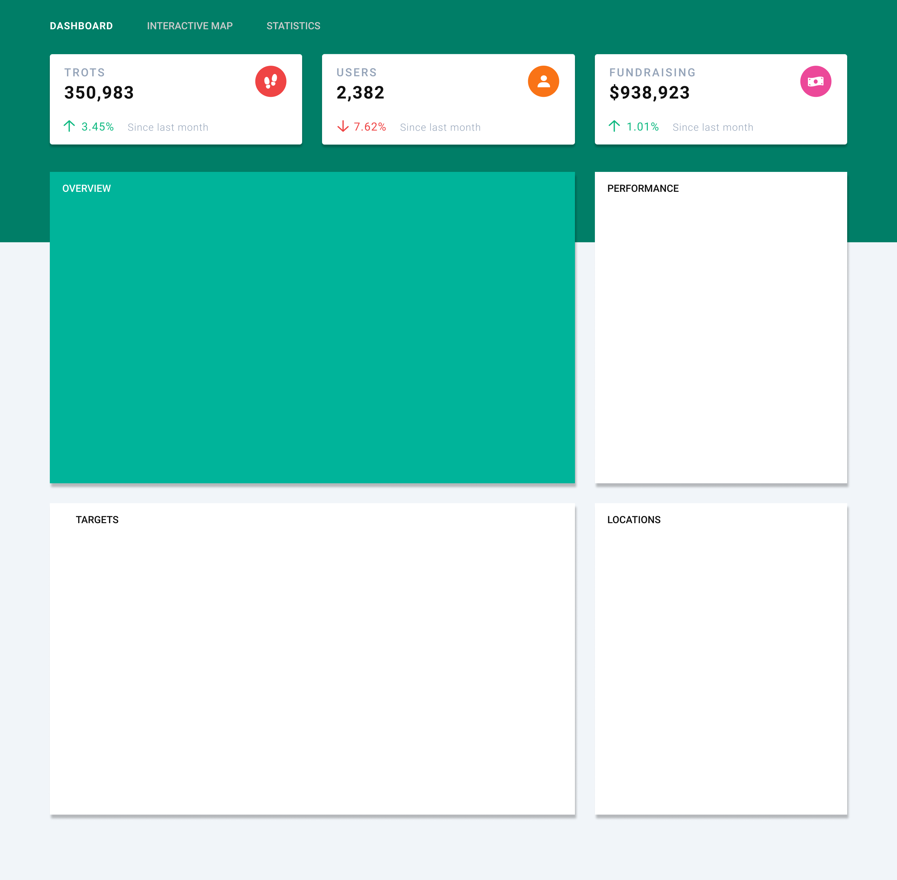
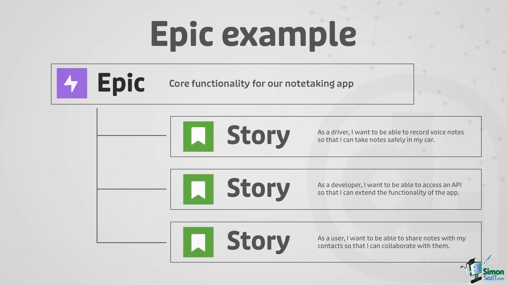

# Class 29 - Project Management & Application Planning

[Class 29 Course Content](https://www.youtube.com/watch?v=nHuhojfjeUY&ab_channel=SimonSezIT)

Computer programmer **Ward Cunningham** on the importance of making fast, reversible decisions:

_"I cannot tell you how much time is spent worrying about decisions that do not matter. To be able to make a decision and see what happens is tremendously empowering, but that means you have to set up the situation such that when something does go wrong, you can fix it."_

## Preparation

### GOALS

By the end of this lesson, you will be able to:

1. **Create a Jira Kanban Board**
2. **Collaborate on GitHub & Jira in a team setting**
3. **Understand Software Development Project Workflow**
4. **Build a Dashboard Demo with a team**

---

---

### CONCEPTS

- **Agile:** _Agile_ is a software development methodology meant to increase teams' efficiency by self-organizing the work to promote rapid and flexible response to change.

- **Sprint:** _Sprint_ is a pre-determined amount of time (usually two weeks) whereby a team decides on and works to finish a specified amount of work.

- **Kanban:** _Kanban_ is a scheduling system or workflow management method developed by an engineer at Toyota that helps visualize the work and promote continuous improvement. A Kanban Board in software development usually consists of these three primary columns laid out side by side:

  - **First Col:** Todo
  - **Second Col:** In Progress
  - **Third Col:** Completed

- **Jira:** _Jira_ is an advanced project management and issue tracking tool.

- **User Story:** A _User Story_ is an example narrative of an imaginary user of a product. A typical user story sounds like this: "As a (product name) user, I want (some goal) so that (some reason)."

- **Epic:** An _Epic_ is a feature or project goal that is too big for a single sprint. They are usually broken down into multiple user stories that, when finished, complete the _Epic_.
  

---

---

## Walkthrough

### STEP 1: Creating a Jira Account and Setting up the Project

**Aim**: Create an Atlassian/Jira account and Setup a demo Kanban Project

| _https://www.atlassian.com/try/cloud/signup?bundle=jira-software&edition=free_ |

- [ ] **Navigate to the Jira Signup page and create an account**

🔻

- [ ] **Run through the questionnaire and answer all questions**

🔻

- [ ] **Give your team a name and set the defaults to Kanban**

🔻

- [ ] **Take the Jira Tour**

---

### STEP 2: Outlining the Dashboard Project

**Aim**: Create sample tasks for the Dashboard Project (the exercise for the day)

| _Jira Project Kanban Board_ |

- [ ] **Create 5 sample tasks and walk through some key features you can add**

  1. **Task 1:** Create the layout for the page
  2. **Task 2:** Add the global styles
  3. **Task 3:** Add the Navigation tab bar
  4. **Task 4:** Create the three top infoboxes
  5. **Task 5:** Create a responsive grid with four dynamic boxes for Overview, Performance, Targets, Locations

---

---

## Additional Notes

### APPLICATION PLANNING NOTES

When creating a new project, some key questions to ask and figure out before you touch a computer are:

- What is the problem we are solving?
- What are some possible solutions to this problem?
- What are the core features that 100% NEED to be implemented to be considered a solid solution?
- What is the priority of these features?
- What tasks need to be done to implement these features successfully?
- What technology is best to implement this functionality?
- Who is involved in the Project, and how can we divide up responsibility equally?
- What are the expected challenges of the Project?
- What quality metrics will define a successful outcome of the Project & product?

After talking with your team on these points, it is crucial to write the answers down so the whole team can be on the same page.

Some key things to include in your project document include a:

- Product Description
- Project Needs
- Team Structure and Roles
- Features and Priorities (MVP) => (Need to Have, Good to Have, Nice to Have)
- Design (Color scheme, fonts, and overall vibe)
- GitHub Branch strategy
- Approximate Project Plan w/ Objectives / Deadlines

Also, find a way the team can check in with each other regularly and discuss where you are and if any changes need to be made to meet the requirements.

Typically, software teams have a weekly standup for 10 minutes as soon as the day begins so everyone can briefly share what they have been working on, any hiccups, and what they plan to do for the week ahead. Of course, you can also do this every day or have longer meetings after a week of solid work; find what works best for you and your team!

---

### EXERCISE

#### OVERVIEW

You and your team will be building out a demo dashboard for today's exercise.

#### GOAL

The goal here is to gain more comfort in three things:

- Working on a team
- Understanding a Kanban board / Jira Workflow
- Practicing GitHub in a team setting

### REQUIREMENTS

1. Team lead will share screen and create a new Jira Project
2. Group will discuss the project features, challenges, and responsibilities
3. Team lead will add members to the Jira project and ensure everyone can access the Kanban Board
4. Team lead will walk through creating and assigning the top priority tasks
5. Team lead will create a GitHub Repository for the Project and add everyone as Collaborators
6. Team will create branches on Jira and tackle their tasks one by one
7. Team will push changes up to main, and everyone else will merge those changes into their branch

_NOTE:_ The instructors will take the last 30 minutes of class to go over each group's Project and discuss what went well and what they could do differently with each team.

---

### RESOURCES

[How to Use JIRA _(Video)_](https://www.youtube.com/watch?v=GWxMTvRGIpc&ab_channel=StewartGauld)

[Planning & Building Projects _(Video)_](https://www.youtube.com/watch?v=Z_gjlIji8hU&ab_channel=TraversyMedia)
