# How to Create & Push to a GitHub Repository

1. Navigate to [GitHub.com](https://github.com)
2. In the top menu bar, all the way on the right, click the plus sign
   
3. Click the first item in the dropdown menu, "New Repository"
   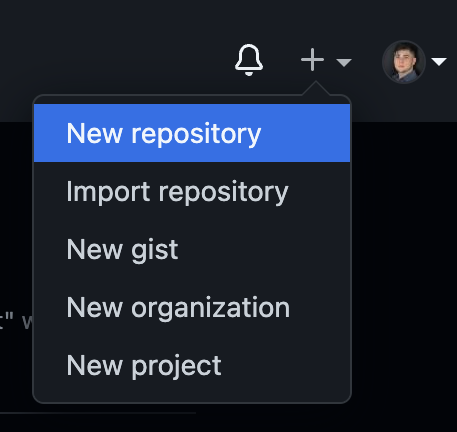
4. Give your Repository a name and click the green button "Create Repository"
   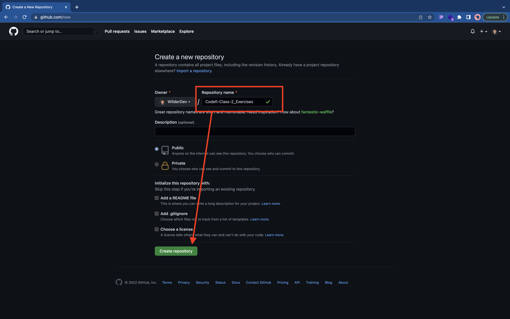
5. You can use the command line, or open up in GitHub Desktop
   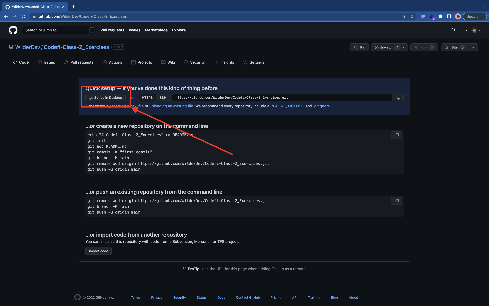
6. In the Local Path tab, you now need to choose a place on your desktop where you want this repository to live locally
   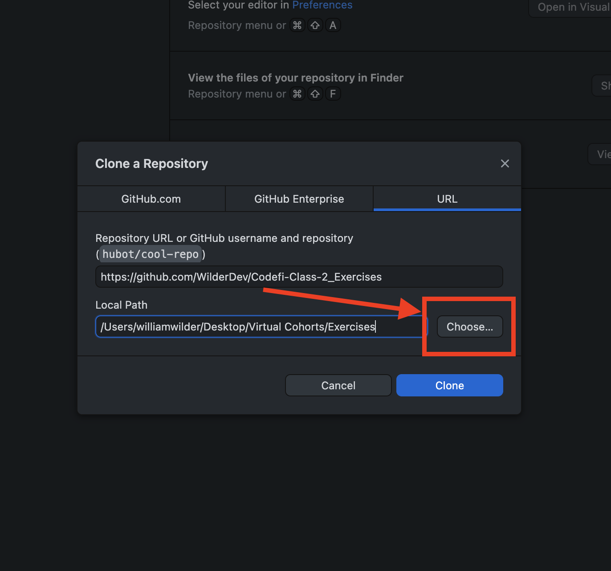
   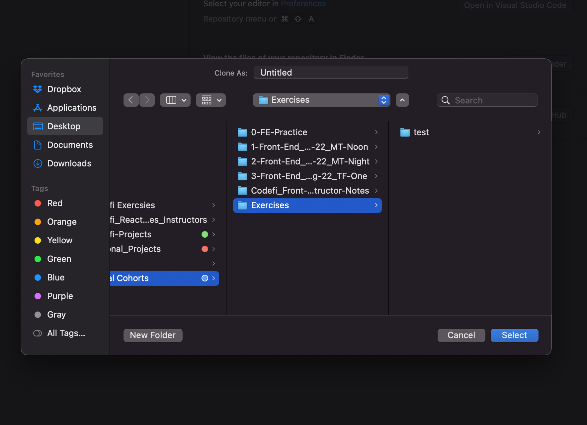
7. Double check everything looks correct & clone the Repository to your local machine
   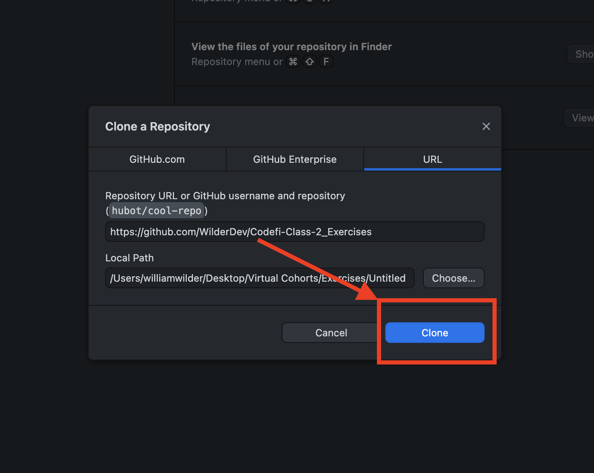
8. Open your repo in Visual Studio Code
   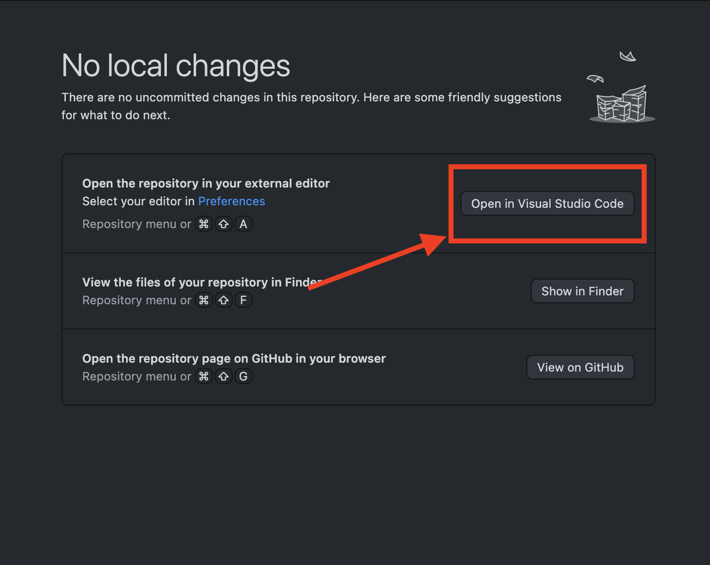
9. Finish the exercises
   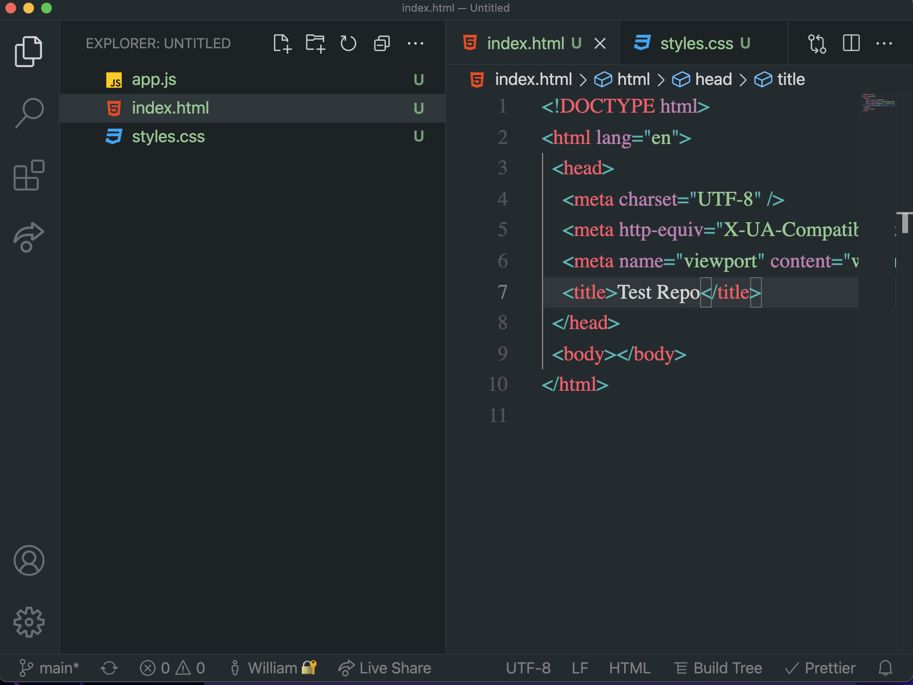
10. Come back to GitHub Desktop and create a commit message
    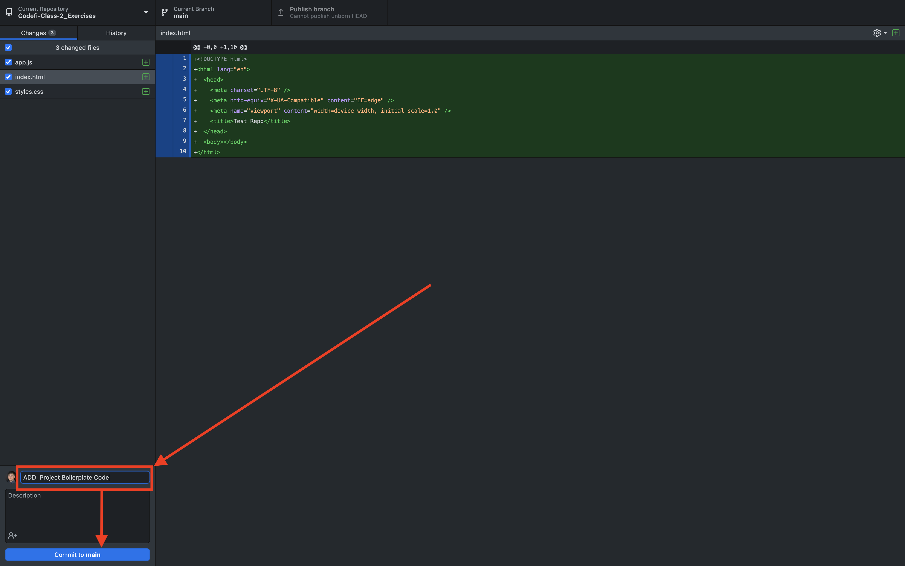
11. Publish your changes to the web
    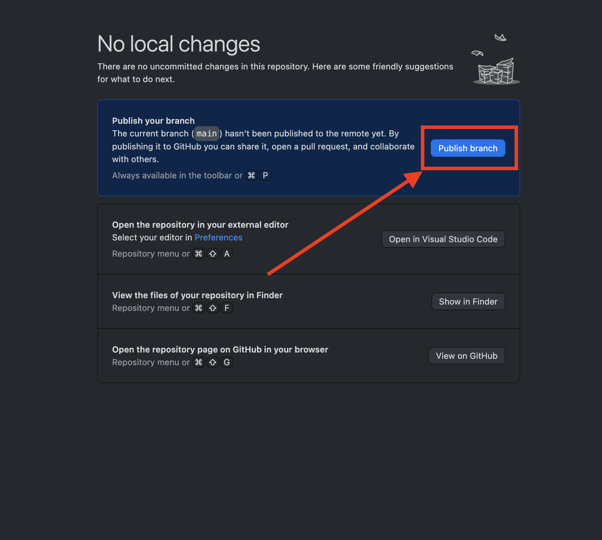
12. View your project on the GitHub Website via GH Desktop
    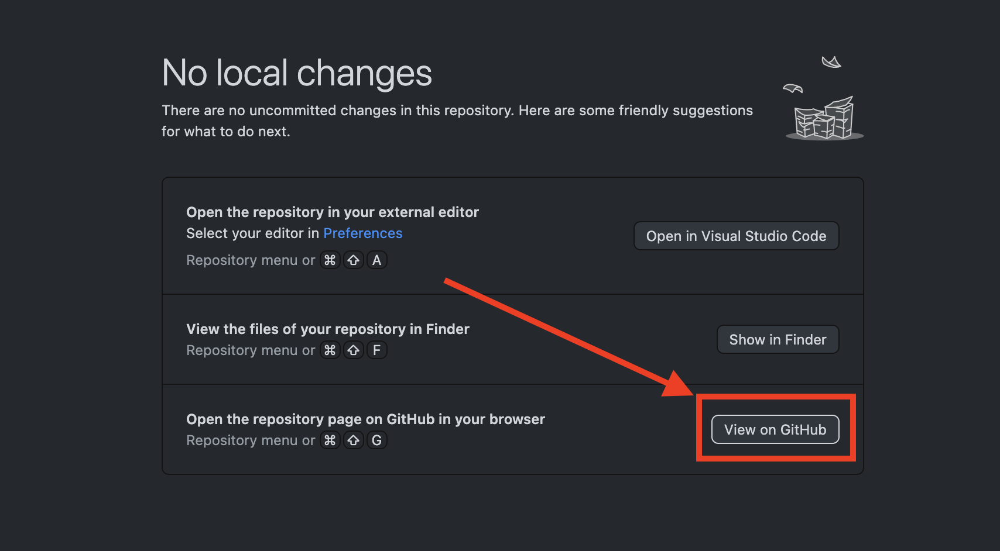
13. Continue making changes to your exercises if you want to keep working
14. Come back to GitHub Desktop at regular intervals and Push your changes upstream
    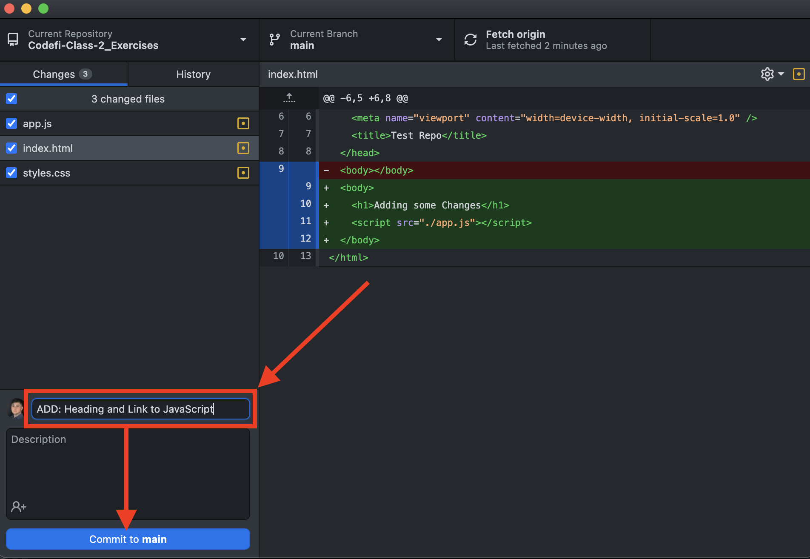
    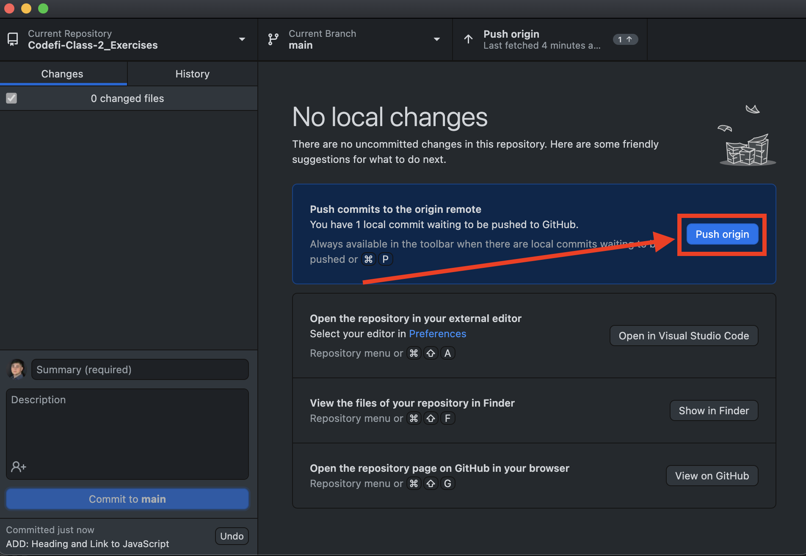
